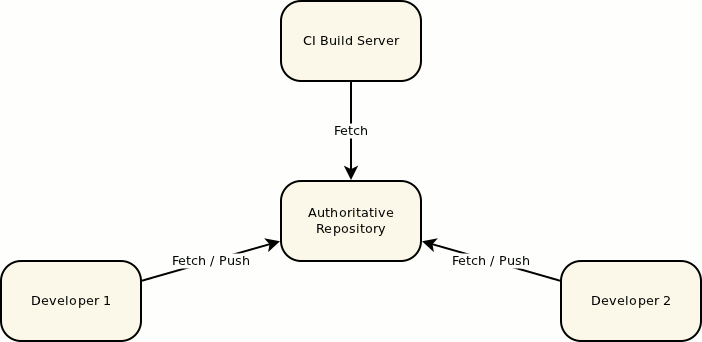
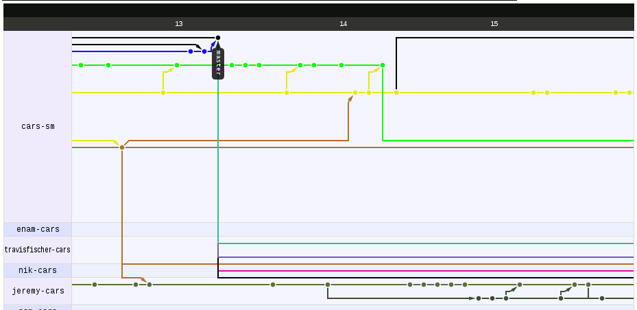
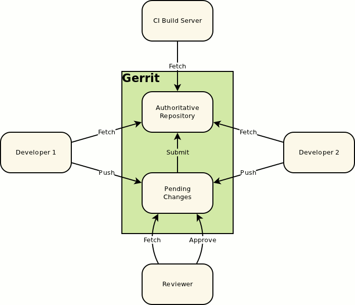
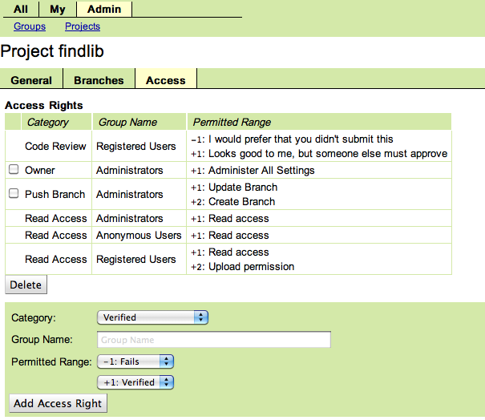

======
Gerrit
======

:Organization: Cars.com
:Author: Seth House <shouse@cars.com>
:Date: 2012-06-27

.. include:: ../beamerdefs.txt

.. Checklist:
..
    [X] When is the presentation?
    [X] How long is the presentation?
        Six minutes.
    [ ] What is the fall-back plan if the presentation duration changes?
    [X] How many will attend?
        1-15
    [X] Who is the audience? Peers, coworkers, investors, superiors?
        Peers & customers (QA)
    [X] Who are the key audience members to influence?
        Users -> managers
    [X] What is the expected audience attention span?
        Above avg.
    [X] Why are these audience members in attendance?
        Define future workflow.
    [X] What does this audience expect?
        High-level overview of workflow.
    [ ] What will get the audience's attention?
    [X] What is the audience's subject knowledge?
        Light
    [X] Will the audience understand jargon?
        Some
    [X] What is the expected reaction to the presentation and the presenter?
        Hostile
    [ ] What are likely audience questions?
    [X] What are possible audience questions that will be hard to answer?
        Q. Gerrit doesn't support feature branches.
        Q. Why is Gerrit worth installing additional infrastructure?

.. 1.   Create a loose outline of ideas, references, and talking points.
.. 2.   Categorize into: must know, need to know, don't need to know (cut).
.. 3.   Restructure into the following sections:
..
    * Opening. Capture attention; avoid introductions and fluff.
    * Current situation. Establish importance.
    * Recommendation.
    * Benefits. Personalize for the audience.
    * Evidence. Support the recommendation; don't revisit current situation.
    * Summary. Short!
    * Action steps. Specific actions; specific time-frame.

.. raw:: latex

    {
    \usebackgroundtemplate{\includegraphics[width=\paperwidth]{china-low-wage-factory-workers.jpg}}
    \begin{frame}[plain]
    \end{frame}
    }

Reptition & complexity
======================

* Slow
* Error prone
* Frustrating

Subversion will be replaced
===========================

.. container:: r2b-note

    * svn is being replaced (yay), but Git can be complex
    * Central repo -> forks -> clones -> remotes.

Git is not perfect
==================

Gerrit
======

Central, simple, automated
==========================

* Devs: One remote; control from Git
* QA: Web interface; control
* Bookeeping & automation

Automation
==========

Adopt Gerrit
============

* Research Gerrit
* Recommend Gerrit
