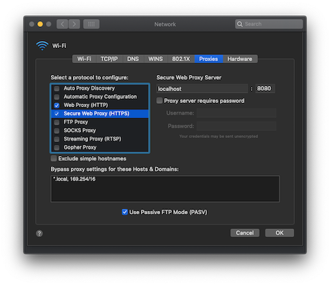

class: center, middle, inverse

<h1 style="color: #777872">
    HTTP
    <br>
    <span style="font: smaller">&amp;<span>
    <br>
    mitmproxy
</h1>

A brownbag workshop at


by Seth House

@whiteinge<br>
seth@eseth.com

---

class: center, middle

# HTTP

---

## Raw HTTP

* All plain text!  (CRLF)
* Request / response.

---

## DIY Manually

1.  `nc -l localhost 8001`
2.  `curl -sSi localhost:8001`
--

3.  In `nc` window type:

    ```
    HTTP/1.0 200 OK
    [...<extra headers here>]
    [blank line]
    [...<response body here>]
    ```

---

## Headers: Host

* Usually sent by HTTP clients.
* Can be overridden.
* Can be used for virtual host lookup.

---

## Headers: Accept

* Content negotiation!
* Client `Accept` header, "I can accept these formats."
* Server `Content-Type` header, "The response is in this format."

---

## Headers: Caching

* Conditional requests!
* Server `Last-Modified` or `ETag`, "The latest version of this page."
* Client `If-Modified-Since` or `If-None-Match`, "Do you have anything more
  recent than this?"

---

## Browser Headers

All bets are off!


---

class: center, middle

# mitmproxy

---

## Installation

1.  `brew install mitmproxy`  
    Or binaries for Linux and Windows.

2.  Run `mitmweb` for the web interface  
    or `mitmproxy` for the CLI interface.

---

## MITM HTTPS Certificates

Visit http://mitm.it and follow the instructions.

(This is a local-only URL when the proxy is running.)

---

## Regular Proxy

1.  Configure and enable OS-level proxy:

    

2.  Run `mitmweb` or `mitmproxy`.

---

## Reverse Proxy

```bash
mitmproxy \
    -p 8003 \
    -k \
    --mode reverse:http://localhost:3003
```

(`-k` does not validate the remote cert; needed for self-signed certs.)

---

## Scripting

```python
from mitmproxy import http

class Cors:
    cors_headers = {
        "Access-Control-Allow-Origin": "http://localhost:8000",
        "Access-Control-Allow-Methods": "GET,POST",
        "Access-Control-Allow-Headers":
            "Authorization,x-csrf-token,content-type",
        "Access-Control-Allow-Credentials": "true",
        "Access-Control-Max-Age": "1728000",
    }

    def response(self, flow):
        flow.response.headers.update(self.cors_headers)

    def request(self, flow):
        if flow.request.method == "OPTIONS":
            flow.response = http.HTTPResponse.make(200, b"",
                self.cors_headers)

addons = [ Cors() ]
```

---

## Scripting

Add CORS headers to an arbitrary remote URL:

```bash
mitmproxy \
    -s /path/to/cors.py \
    -p 8003 
    -k \
    --mode reverse:http://localhost:3003
```
