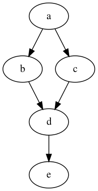
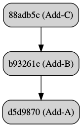
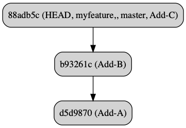
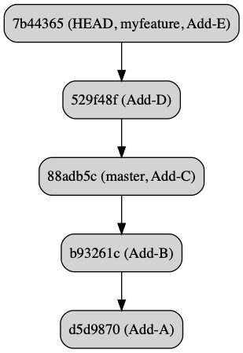
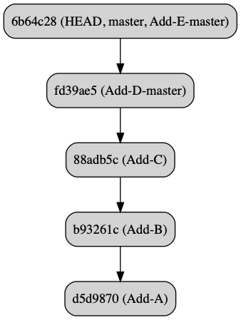
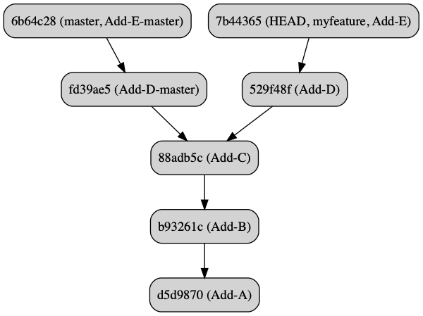
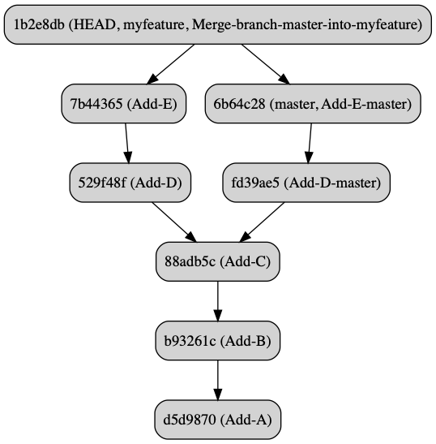
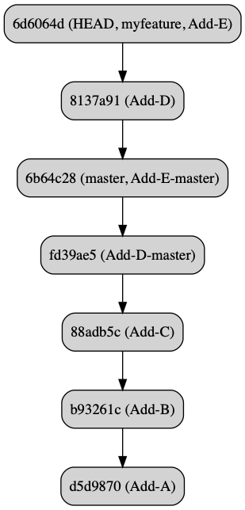
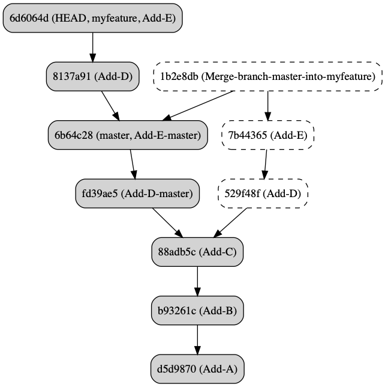

class: center, middle, inverse

# Git: Merge vs. Rebase

A brownbag workshop at


by Seth House

@whiteinge<br>
seth@eseth.com

---

class: center, middle

## Git Mental Model

[](https://en.wikipedia.org/wiki/Directed_acyclic_graph)

Directed acyclic graph (DAG).

---

### Branches are pointers to nodes

```
% cat .git/refs/heads/master
6b64c2889d97b456f4682fdbe8c46d69e556c24d
```

--

See also: `.git/packed-refs`.

---

### Destructive Operations

You don't remove data from Git.  
Git garbage collects data itself.

--

If it's in a commit, it's safe.

--

After 90 days.  
`git reflog --date=relative`

---

class: center, middle

## Utils

---

### `~/.gitconfig`

```
[alias]

# Make a stub commit with file and file contents.
stub = "!sh -c 'echo $1 > $1; git add $1; git commit -m Add-$1' -"
```

---

### `git-graph-dag`

1.  https://github.com/whiteinge/dotfiles/blob/master/bin/git-graph-dag
2.  Add to your `$PATH`.
3.  Available as `git graph-dag`.
4.  See comments for prerequisites and usage.

--

```
% git graph-dag -c [...<refA> <refB>] \
    | dot -Tpng \
    | open -a Preview.app -f
```

---

### Set up

```
% git init mergerebase
Initialized empty Git repository in /private/tmp/mergerebase/.git/

% cd mergerebase
/private/tmp/mergerebase
```

---

class: center, middle

## Merge

---

### Commit to `master`

.left-column[
```
% git stub A
[master (root-commit) d5d9870] Add-A
 1 file changed, 1 insertion(+)
 create mode 100644 A

% git stub B
[master b93261c] Add-B
 1 file changed, 1 insertion(+)
 create mode 100644 B

% git stub C
[master 88adb5c] Add-C
 1 file changed, 1 insertion(+)
 create mode 100644 C
```
]

.right-column[


`git graph-dag -c master`
]

---

### Create `myfeature`

.left-column[
```
% git co -b myfeature
Switched to a new branch 'myfeature'

% git branch --set-upstream-to=master
Branch 'myfeature' set up to track local branch 'master'.
```

Same commit in the DAG.  
Just a new pointer.
]

.right-column[


`git graph-dag -c myfeature`
]

---

### Commit to `myfeature`

.left-column[
```
% git stub D
[myfeature 529f48f] Add-D
 1 file changed, 1 insertion(+)
 create mode 100644 D

% git stub E
[myfeature 7b44365] Add-E
 1 file changed, 1 insertion(+)
 create mode 100644 E
```
]

.right-column[


`git graph-dag -c myfeature`
]

---

### Meanwhile, back on `master`...

.left-column[
```
% git co -
Switched to branch 'master'

% git stub D-master
[master fd39ae5] Add-D-master
 1 file changed, 1 insertion(+)
 create mode 100644 D-master

% git stub E-master
[master 6b64c28] Add-E-master
 1 file changed, 1 insertion(+)
 create mode 100644 E-master
```
]

.right-column[


`git graph-dag -c master`
]

---

### `myfeature` and `master` have diverged

.left-column[
```
% git co -
Switched to branch 'myfeature'
Your branch and 'master' have diverged,
and have 2 and 2 different commits each, respectively.
  (use "git pull" to merge the remote branch into yours)
```
]

.right-column[


`git graph-dag -c master myfeature`
]

---

### Update `myfeature` with `master` via merge

.left-column[
```
% git merge master
Merge made by the 'recursive' strategy.
 D-master | 1 +
 E-master | 1 +
 2 files changed, 2 insertions(+)
 create mode 100644 D-master
 create mode 100644 E-master

% git rev-parse --short HEAD
1b2e8db
```
]

.right-column[


`git graph-dag -c master myfeature`
]

---

### Undo the merge (move the `myfeature` pointer)

.left-column[
```
% git reset --hard HEAD~1
HEAD is now at 7b44365 Add-E
```
]

.right-column[


`git graph-dag -c master myfeature`
]

---

### Update `myfeature` with `master` via rebase

.left-column[
```
% git rebase
First, rewinding head to replay your work on top of it...
Applying: Add-D
Applying: Add-E
```
]

.right-column[


`git graph-dag -c master myfeature`
]

---

### Both merge and rebase

The merge is still safely in the DAG.



`git graph-dag -c master myfeature 1b2e8db`
