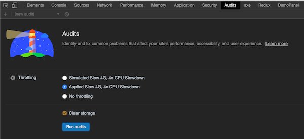
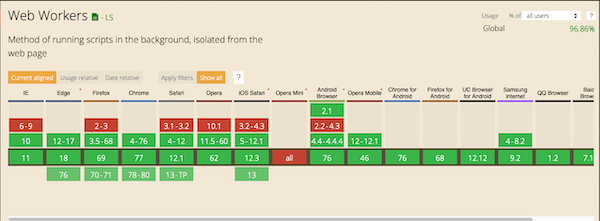

class: center, middle, inverse

# Web Workers

A brownbag workshop at


by Seth House

@whiteinge<br>
seth@eseth.com

???

* App organization tips:

  * Put lots of stuff in the worker.
  * Dispatch function calls!
  * Avoid bundling third-party libs shared between DOM & worker.

---

class: center, middle

# Why web workers?

---

## The UI thread can be blocked.

Heavy computation can make the UI completely unresponsive -- animations,
mouseovers, clicks, etc.

--

```js
// Block the UI thread (on purpose)
function sleep(time) {
    var now = Date.now();
    while (Date.now() < (now + time)) {}
}
```

--

[Another example](http://afshinm.github.io/50k/)

---

## ...especially on lower end devices.

--

* No substitute for testing.
* Use `console.time('foo'); console.timeEnd('foo');`
* Use Lighthouse in Chrome dev tools:



---

## There have been hacks...

```js
function heavyComputation() {
    // ...do part of a thing.
    setTimeout(function() {
        // ...next part.
        setTimeout(function() {
            // ...next part.
            setTimeout(function() {
                // ...next part.
            }, 50);
        }, 50);
    }, 50);
}
```

---

## But now we have web workers!



---

class: center, middle

# How web workers

---

## Start a dedicated thread.

```js
var myWorker = new Worker('./path/to/script.js');
```

--

...or via a crazy workflow that involves stringifying functions.

--

This part is async.

---

## Worker features.

* The `navigator `object.
* The `location` object (read-only).
* `XMLHttpRequest`.
* `setTimeout`()/`clearTimeout`() and `setInterval`()/`clearInterval`().
* The Application Cache.
* Importing external scripts using `importScripts()`.
* Creating other web workers.

---

## Messaging.

* Copy (for messages).
* Transfer (for binary data (like images)).

---

## Import scripts.

```js
importScripts('./lib/lodash.min.js');
```

--

This part is synchronous!  

--

Even works in IE10.

---

## Worker tips

* Put lots of stuff in the worker.
* Dispatch function calls (e.g. the Redux pattern).
* Avoid bundling third-party libs shared between DOM & worker.
