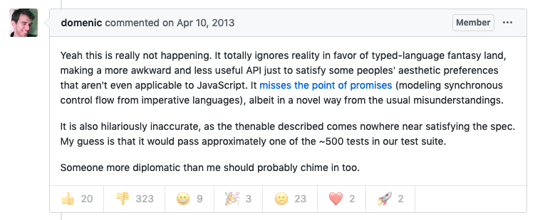
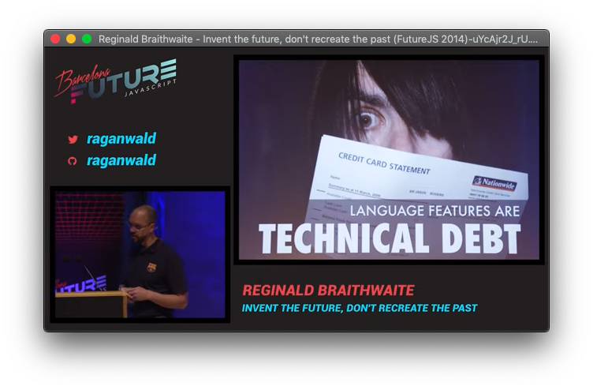
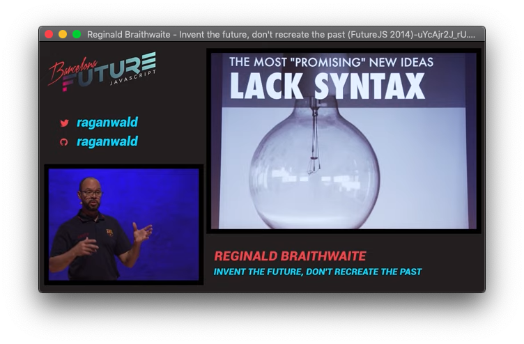
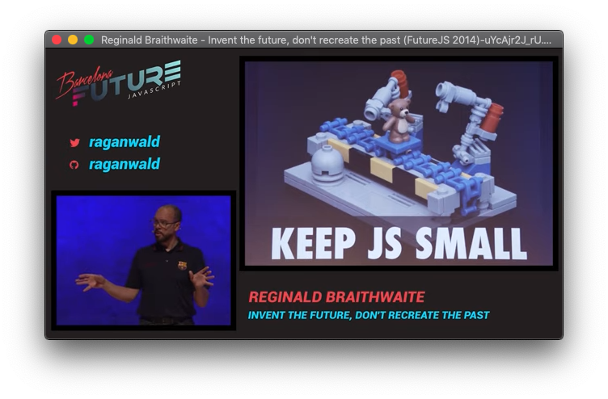

class: center, middle, inverse

<h1>
    A Short History
    <br>
    <span style="font-size: 40%">of</span>
    <br>
    <span style="font-size: 60%">
    XMLHttpRequest & Promises
    </span>
</h1>

A brownbag presentation at


by Seth House @whiteinge

---
class: center, middle
# XMLHttpRequest

---
class: center, middle
## History of XHR

---
class: image-slide image-slide-tall
background-image: url(./img/dhtml.webp)

### DHTML was in the air

---
### Fetch data after page load

--

* iframe trick.
--

* Keep HTTP response connection open & stream the response body.
--

* Dynamically add script tags.

???

Dynamically show a hidden iframe to load the remote data.

* No loading status.
* No (easy) multithreading.
* Worked with the back button (!).
* Worked for cross-site calls.

These techniques persisted for years. XMLHttpRequest req'd ActiveX to be
enabled in IE & other drawbacks.

---
### The first XMLHttpRequest

* 1998 — Outlook Web Access (OWA) project.
--


> The IE project was just weeks away from beta 2 which was their last beta
> before the release. [...] I realized that the MSXML library shipped with IE
> and I had some good contacts over in the XML team who would probably help
> out- [we] struck a deal to ship the thing as part of the MSXML library.
>
> — https://web.archive.org/web/20160630074121/http://www.alexhopmann.com/xmlhttp.htm

???

Sometime in 1998 at Microsoft Alex Hopmann (and Shawn Bracewell) wrote the
first XMLHttpRequest implementation. He was tasked with starting work on
Outlook Web Access (OWA) for Exchange 2000 and could make it as a traditional,
server-side web app or he could wade into the new DHTML approach of dynamic
interfaces. DHTML at the time was the novel use of JavaScript and CSS to
dynamically change the DOM after the initial page load. E.g., change colors,
change positions, expand/collapse, show/hide animated images.

The implentation was not tied to XML in any way although he did use XML as the
serialization format because it was new and exciting (and JSON was a couple
years away from being "discovered").

---
### Adoption

Browser | XHR added
------- | ---------
Mozilla (rel. 2000) | 2000 (compl. 2002)
Safari (rel. 2003) | 2004
Opera | 2005

---
### Five years pass...

<a alt="Crockford on JavaScript" href="https://www.youtube.com/playlist?list=PL7664379246A246CB">
    
</a>

--

Bugs, browser wars, Netscape dies, Microsoft wins.

---
### JavaScript should have died with Netscape, but...

--

* 2005 — "Ajax" (JavaScript, CSS, DOM, & XHR)

> [A]pproach the "richness and responsiveness" of desktop applications.

???

Developers at a company named Adaptive Path released a blog post in 2005 that
coined the term Ajax [1].

[1] https://web.archive.org/web/20190226075734/https://adaptivepath.org/ideas/ajax-new-approach-web-applications/

---

### Inevitable

> [...] these things take 3-5 years, so its not much of a surprise that the
> stuff that was developed incrementally between 1996 and 1998 actually started
> to hit it big in 2000-2002 and really exploded in 2005-2006.
>
> — https://web.archive.org/web/20160630074121/http://www.alexhopmann.com/xmlhttp.htm

???

That is the story of the ajax we have but it was also an inevitability. Someone
else would have made something similar eventually. Java applets had remote
scripting capabilities as early as 2001 [1]. Macromedia Flash had remote data
capabilities in 2004.

[1] https://www.ibm.com/developerworks/web/library/wa-resc/

---
### Standardization

Year | Event
---- | -----
2006 | W3C XMLHttpRequest
2006 | jQuery released
2007 | IE 7 (no ActiveX)
2008-2011 | XHR2 (absorbed into original spec)

---
class: center, middle
## XHR capabilities

---
### Basic usage

```js
var oReq = new XMLHttpRequest();
oReq.addEventListener('load', function() {
    console.log(this.responseText);
});
oReq.open('GET', 'https://api.github.com/users');
oReq.send();
```

---
### Common usage (callback)

```js
function xhr(method, path, data, headers, callback) {
    var req = new XMLHttpRequest(),
        default_headers = { /* ... */ };


    req.open(method.toUpperCase(), path, true);
    // For each: req.setRequestHeader(key, value);

    req.onreadystatechange = function(ev) {
        if (req.readyState !== 4) { return }

        if (req.status === 200) {
            callback(ev.target.response)
        } else {
            /* log error or whatevs */
        }
    };

    req.send(data);
}
```

---
### Common usage (promise)

```js
function xhr(method, path, data, headers) {
    var req = new XMLHttpRequest(),
        default_headers = { /* ... */ },
        deferred = Q.defer();

    req.open(method.toUpperCase(), path, true);
    // For each: req.setRequestHeader(key, value);

    req.onreadystatechange = function(ev) {
        if (req.readyState !== 4) { return }

        if (req.status === 200) {
            deferred.resolve(e.target.response);
        } else {
            deferred.reject(e.target.response);
        }
    };

    req.send(data);
    return deferred.promise;
}
```

---
### Cancellable (abort)

```js
var oReq = new XMLHttpRequest();
oReq.open('GET', 'https://httpbin.org/delay/1000');
oReq.onreadystatechange = console.log;
oReq.send();
setTimeout(() => oReq.abort(), 100);
```

---
### Timeout

(FF implementation courtesy of our own Alex Vincent!)

```js
var oReq = new XMLHttpRequest();
oReq.open('GET', 'https://httpbin.org/delay/5000');
oReq.onreadystatechange = console.log;
oReq.timeout = 1000;
oReq.send();
```

---
### Progress

```js
var oReq = new XMLHttpRequest();
oReq.open('GET', 'https://httpbin.org/drip');
oReq.onprogress = ev =>
    console.log('XXX', (ev.loaded / ev.total) * 100, '%')
oReq.send();
```

---
### Stream

```js
var oReq = new XMLHttpRequest();
oReq.open('GET', 'https://httpbin.org/drip');
oReq.seenBytes = 0;
oReq.onreadystatechange = () => {
  if (oReq.readyState === 3) {
    oReq.seenBytes = oReq.responseText.length;
    console.log('seenBytes', oReq.seenBytes);
  }
};
oReq.send();
```

---
### Tangent: Server-sent Events

Simple, one-directional stream.

--

```python
# Python server
response.headers["Content-Type"] = "text/event-stream"
response.headers["Connection"] = "keep-alive"

def listen():
    events = get_events()
    yield str("retry: 400\n")

    while True:
        data = next(events)
        yield str("tag: {0}\n").format(data.get("tag", ""))
        yield str("data: {0}\n\n").format(json.dumps(data))
```

--

```js
// JavaScript client
var stream = new EventSource('/stream');
stream.onmessage = function(ev) {
    console.log('XXX', ev.data)
}
```

---
### XHR control structures

* Agnostic.
* Success callback, error callback, promise, stream, task, etc.

---
class: center, middle
## Fetch

---
### Basic usage

Clean & simple API

```js
fetch('https://api.github.com/users', { /* options */ })
    .then(response => response.json())
    .then(console.log);
```

---
### Robust usage

```js
fetch('https://api.github.com/users', { /* options */ })
    .then(response => {
        if (!response.ok) {
            throw new Error('Network response was not ok')
        }
        return response;
    })
    .then(response => {
        if (response.headers
                .get('content-type')
                .includes('application/json')) {
            return response.json();
        } else {
            return response.body();
        }
    })
    .then(console.log)
    .catch(console.error);  // beware: optional!
```

???

- http://jamesknelson.com/are-es6-promises-swallowing-your-errors/

---
### Fetch only implements a subset of XHR

Missing:

* Abort.
* Timeout.
* Progress.
* Stream (new in evergreens; no IE 11).
* Control flow agnosticism.

---
### Promise-based

Inherits all the drawbacks of promises.  
(See next section.)

---
### Ajax libs are _always_ wrapped

--

* Abstract boilerplate request formatting:
--

  * Add common request headers.
--

  * Send request as JSON.
--

  * Authenticate requests:<br><span class="quiet">(add auth header or opt-in to sending cookies)</span>.
--

  * Enable CORS.
--

  * Send XSRF token.
--

* Consistent response parsing:
--

  * Parse as JSON.
--

  * Handle redirects:<br><span class="quiet">301 (Permanent), 302 (Temporary).</span>
--

  * Handle no-content responses:<br><span class="quiet">201 (Created), 202 (Accepted), 204 (No Content).</span>
--

  * Handle authorization responses:<br><span class="quiet">401 (Unauthorized), 403 (Forbidden).</span>
--

  * Success vs error responses:<br><span class="quiet">400 (Client Error), 404 (Not Found), 409 (Conflict),<br>500 (Server Error), 502 (Gateway Unavailable), 503 (Service Unavailable).</span>
--

* Response caching & conditional-GET requests:<br><span class="quiet">If-None-Match/If-Modified-Since, 304 (Not Modified).</span>

---
### Wrap XHR or wrap fetch

```js
import {myAjax} from 'utils/ajax';

myAjax(/* params */)
    .then(() => console.log(`Am I XHR or fetch?`));
```

--

The underlying implementation _doesn't matter_ if it suits your needs.  
XHR, fetch, jQuery, Axios, Rx, etc.

--

Choose an API, choose a primitive, and wrap it.

--

...and the implementation should be changeable. This is the _Facade_ pattern.

---
class: center, middle
# Promises

<span class="quiet">(Not an introduction or how-to.)</span>

---
class: center, middle
## Before promises

---
### Callbacks

--

#### Blocking

```js
['foo', 'bar', 'baz'].map(x => x.toUpperCase());
```

Implemented via pointers (C) or first-class functions.

--

#### Deferred

```js
setTimeout(() => console.log('Call me'), 1000);
```

Run function on a different thread or processor (or queue).

--

...we're only talking about deferred callbacks here.

---
### Continuation passing style (CPS)

* 1975 — first implemented in Scheme.
--

* Program control flow is explicit — a continuation.
--

* Callbacks are a _small subset_ of true CPS.
--

* call/cc<br><span class="quiet">`race()`/`amb()`, backtracking, coroutines, generators, engines, threads, try/catch.<br>Breaking a long computation into chunks.</span>
--

* Hard to write/maintain.<br><span class="quiet">(Often a compile target, esp for langs with TCO.)</span>
--

* 1976/1977 — Promises/futures first described.
* 1988 — Promise pipelines first described.
--

* 1980-1990s — Monads from mathematics first linked to programming.

???

CPS

* Callbacks are a subset of continuation passing style (CPS) (missing a way to
  capture certain states from the stack frame for true CPS; also missing
  tail-call optimization, but async callbacks avoid the call stack via a queue)

- https://en.wikipedia.org/wiki/Continuation-passing_style
- https://en.wikipedia.org/wiki/Continuation-passing_style#Continuations_as_objects

> The difference between a continuation and a callback is that after a callback
> is invoked (and has finished) execution resumes at the point it was invoked,
> while invoking a continuation causes execution to resume at the point the
> continuation was created.
>
> — https://stackoverflow.com/a/40228511/127816

call/cc

> With call/cc a variety of complex control operators can be implemented amb
> operator for nondeterministic choice [race() in JS promises], [...]
> backtracking, [...] coroutines, [...] generators, or engines and threads
> [...].
>
> — https://en.wikipedia.org/wiki/Call-with-current-continuation

Other call/cc capabilities

- try/catch
- other control flow structures
- breaking a lengthy computation up into smaller bits to not completely block
  a thread.

>  The hefty computation did one step, and passed the control to the
>  superfluous computation. This in turn did one step and passed control back
>  to the hefty computation. Now this of course did a step and passed control
>  to the superfluous computation. And... You get the pattern. These two
>  procedures are calling each other alternatingly, passing control between the
>  two. Of course, this is not limited to two procedures, but could be done
>  between any number of procedures. Procedures which pass control between them
>  like this are called Coroutines, since they are effectively processed in
>  parallel.
>
> — http://community.schemewiki.org/?call-with-current-continuation

Promises

> Use of futures may be implicit (any use of the future automatically obtains
> its value, as if it were an ordinary reference) or explicit (the user must
> call a function to obtain the value
>
> — https://en.wikipedia.org/wiki/Futures_and_promises

- http://dist-prog-book.com/chapter/2/futures.html

Monads

> One other noteworthy use for monads is isolating side-effects, like
> input/output or mutable state, in otherwise purely functional code. Even
> purely functional languages can still implement these "impure" computations
> without monads, via an intricate mix of function composition and
> continuation-passing style (CPS) in particular.[3] With monads though, much
> of this scaffolding can be abstracted away, essentially by taking each
> recurring pattern in CPS code and bundling it into a distinct monad.
>
> — https://en.wikipedia.org/wiki/Monad_(functional_programming)#Usage

---
### Tangent: Lisp/Scheme and ML languages

--

* Entreaties: these concepts have merit!
--

* First class functions
* Higher order functions
* Principled function composition.
--

* All things we take for granted in JS today.<br><span class="quiet">(Hopefully TCO soon as well.)</span>

---
class: center, middle
## Then Came Promises

---
### Pyramid of doom (callback hell)

--

Problem

```js
doSomething(function(result) {
    doSomethingElse(result, function(newResult) {
        doThirdThing(newResult, function(finalResult) {
            console.log('Got the final result: ' + finalResult);
        }, failureCallback);
    }, failureCallback);
}, failureCallback);
```
--

Solution

```js
doSomething()
    .then(result => doSomethingElse(result))
    .then(newResult => doThirdThing(newResult))
    .then(finalResult => {
        console.log(`Got the final result: ${finalResult}`);
    })
    .catch(failureCallback);
```

???

- https://en.wikipedia.org/wiki/Pyramid_of_doom_(programming)
- https://developer.mozilla.org/en-US/docs/Web/JavaScript/Guide/Using_promises

---
### Three states

Initialized
```js
const myPromise = new Promise((resolve, reject) => {
    /* snip */
});
```
--

Resolved
```js
myPromise.then(/* snip */);
```
--

Rejected
```js
myPromise.catch(/* snip */);
```

--

<span class="quiet">(_No_ visibility and _little_ control over the current
state.)</span>

---
### Caching _and_ control flow

```js
const myUsers = fetch('https://api.github.com/users');
myUsers.then(console.log);
myUsers.then(console.log);
myUsers.then(console.log);
```
--

<span class="quiet">(_No_ visibility and _no_ control over the cache.)</span>

---
### Always async

...Even if already resolved. For consistency.

---
### Tangent: Various async queues in JS

--

Task  
A queue of things to run in each turn of the event loop.

--

Microtask  
A queue of things to run during a single task.

--

requestAnimationFrame  
A queue of things to run at an optimal time for rendering performance.

---
### Tangent: Browser async implementations


???

- https://jakearchibald.com/2015/tasks-microtasks-queues-and-schedules/

---
class: center, middle
## Promises, a missed opportunity

---
### Many, many variants of async control structures

Promises, deferreds, tasks, futures, reactive streams, FRP streams, callbags.

---
### Existing library ecosystem

* q<br><span class="quiet">(progress, handle unhandled errors, introspection of current state)</quiet>
--

* bluebird<br><span class="quiet">(progress, cancelation)</span>
--

* when<br><span class="quiet">(by the cujojs folk; lift, join, spread, fold, finally, else, tap, delay, timeout, inspect, progress, map, filter, reduce, and more)</span>

---
### The infamous GitHub discussion

--



???

- https://github.com/promises-aplus/promises-spec/issues/94

---
### Fantasy Land Specification

(aka "Algebraic JavaScript Specification")


???

- https://github.com/fantasyland/fantasy-land

---
### Function composition (got it right!)

```js
const capitalize = x => x.toUpperCase();
const exclaim = x => `${x}!`;

Promise.resolve('foo')
    .then(capitalize)
    .then(exclaim)
    .then(console.log)
// => FOO!
```

--

Equivalent to!

```js
const compose = (f, g) => (...args) => f(g(...args));

Promise.resolve('bar')
    .then(compose(exclaim, capitalize))
    .then(console.log);
// => BAR!
```

---
### Combinators (got it wrong)

Only two composition operators:

* `Promise.all()`
* `Promise.race()`

<span class="quiet">(Possible to add more but limited by the next two
problems.)</span>

---
### Auto-flattening (got it wrong)

No inner-promises — prevents generating promises for composition.

```js
const makeTimer = time => new Promise(res => setTimeout(res, time))

console.time('Want one second')
Promise.resolve(null)
    .then(() => makeTimer(1000))
    .then(generatedTimer =>
        // No way to both generate and parallelize.
        Promise.all([
            generatedTimer,
            makeTimer(1000),
        ]))
    .then(() => console.timeEnd('Want one second'))
```

---
### Eager execution (got it wrong)

Composition requires absolute knowledge of when the promise was initialized.

```js
const delay1sec = new Promise(res => setTimeout(res, 1000));

// Does not necessarily wait for 1 second.
// Depends entirely on when/where delay1sec was initialized.
Promise.all([
    delay1sec,
    Promise.resolve('foo'),
])
.then(console.log)
```

---
### Tasks (implementation)

```js
const compose = (f, g) => (...args) => f(g(...args));

class Task {
    constructor(fork) { this._fork = fork }

    fork(rej, res) {
        try { return this._fork(rej, res) }
        catch (e) { return rej(e) }
    }
    map(f) { return new Task((rej, res) =>
        this.fork(rej, compose(res, f))) }
    chain(f) { return new Task((rej,res) =>
        this.fork(rej, x => f(x).fork(rej, res))) }

    static of(x) { return new Task((rej, res) => res(x)) }
}
```

---
### Tasks (basic use; sequential flattening)

```js
const makeTimer = time =>
    new Task((rej, res) => setTimeout(res, time))

console.time('XXX')
makeTimer(1000)
    .chain(() => makeTimer(1000))
    .fork(console.error, () => console.timeEnd('XXX'))
```

---
### Tasks (generated; no flattening)

```js
const makeTimer = time =>
    new Task((rej, res) => setTimeout(res, time))

console.time('XXX')
Task.of(null)
    .map(() => [1000, 1000, 1000].map(x => makeTimer(x)))
    .chain(timerArray => timerArray.reduce(
        (ts, t) => ts.chain(() => t),
        Task.of(null)))
    .fork(console.error, () => console.timeEnd('XXX'))
```

---
### Control structure for request/response

Possible states of a request/response cycle:

1.  Not requested.
2.  In-flight.
3.  One or more successes, or error.

---
### Tangent: Streams

* Rx<br><span class="quiet">Highly composeable, caching & control flow & granular control over both, sync or async & granular control over sync/task/microtask/animationframe/virtual queues, initialize, resolve (zero or more times), reject, cancel, retry, progress, timeout.</span>
--

* The core _idea_ defines what is possible, not the implementation.<br><span class="quiet">Most, XStream, Callbags, Flyd</span>

---
class: center, middle
# The Future

---
## Language features vs. user space



---
## Syntax vs. language maintenance



---
class: center, middle
## Async/await

---
### Inherits all the downsides of promises...because it _is_ promises

---
### Debate: is "hiding" async a valuable end-goal?

---
## Debate: Crockford, Raganwald — keep JS small



???

* [Invent the Future, Don't Recreate the Past](https://www.youtube.com/watch?v=uYcAjr2J_rU)
