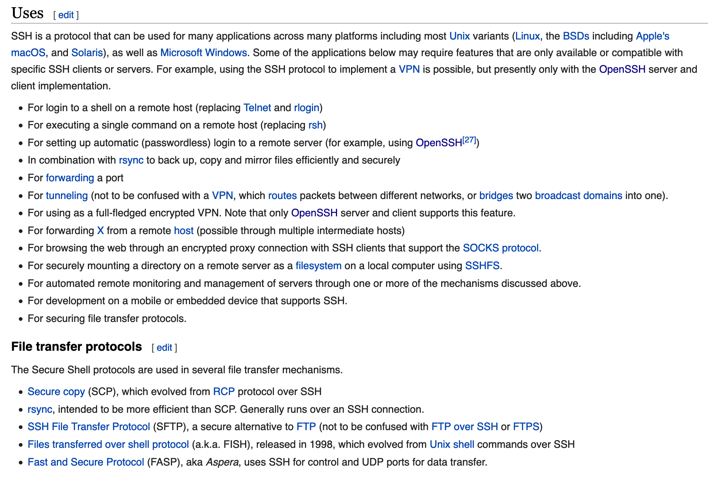
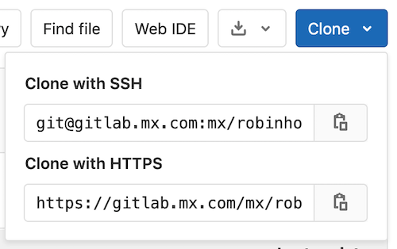
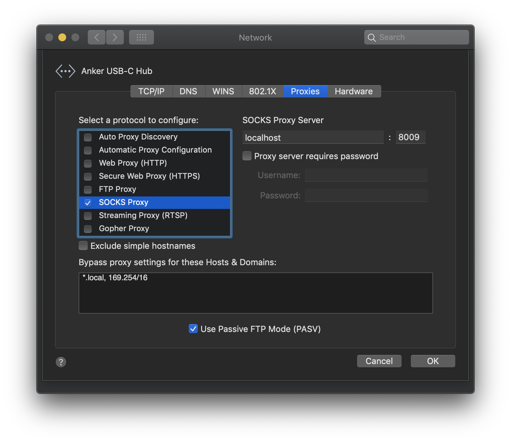

class: center, middle

<h1>
    SSH
    <br>
    <span style="font-size: 60%">Intro &amp; Tricks</span>
</h1>

A brownbag presentation at


by Seth House @whiteinge

---

class: center, middle

# Basics

---

## `ssh` – secure shell

Replacement for telnet and other plain-text protocols.

--

Year | Release
---- | -------
1995 | Released as freeware; then made proprietary
1999 | OpenSSH forked
2006 | Adopted as standard by IETF (Version 2)

---

## A suite of CLI utilities and daemons

```man
SSH(1)			  BSD General Commands Manual			SSH(1)

[...snip...]

SEE ALSO
     scp(1), sftp(1), ssh-add(1), ssh-agent(1), ssh-keygen(1),
     ssh-keyscan(1), tun(4), ssh_config(5), ssh-keysign(8), sshd(8)
```

---

class: image-slide

## Uses

https://en.wikipedia.org/wiki/Secure_Shell#Uses



---

## Basic usage

```bash
ssh <hostname>
ssh <user>@<hostname>
ssh <user>@<hostname> -p <port>
```

--

```bash
ssh <alias>
```

---

## Password authentication

```bash
ssh <host>
```

---

## Public/private keypairs

```bash
ssh-keygen
```

--

Ok to share `.pub` file:

* `~/.ssh/authorized_keys`
* https://github.com/whiteinge.keys

--

Ok to have many identities.

```bash
% tree ~/.ssh
|-- id_rsa-personal
|-- id_rsa-personal.pub
|-- id_rsa-work
|-- id_rsa-work.pub
|-- id_rsa-misc
`-- id_rsa-misc.pub
```

--

Ok to have device-specific identities
(work laptop, home desktop, phone, etc).

--

**Not ok** to omit a passphrase!

---

## Certificates

Managing individual user keys is awful at scale.

---

## Key formats and exchange algorithms

Client and server negotiate acceptable mechanisms.

```bash
ssh -v <host>
```

---

## Run a command

```bash
ssh <host> 'whoami'
ssh <host> 'hostname; whoami; uptime'
```

--

```bash
printf '%s\n' server-{1..24} | xargs -P6 -I{} ssh {} \
    'echo $(hostname) $(cat /srv/app/current/REVISION)'
```

---

## Transfer a file

```bash
scp <src> <dest>
scp -r <src> <dest>
```

--

```bash
scp somefile user@host:/path/to/dest
scp somefile user@host:~
scp somefile user@host:~/dest

scp user@host:/path/to/src .
scp user@host:/path/to/src ./somedir/dest
scp user@host:/path/to/src ~/dest
```

--

```bash
scp -P <port> somefile user@host:~
```
(Capital `-P` !)

---

### sftp & rsync

Drop-in replacement for an FTP server.

--

Works out-of-box with rsync.

```bash
rsync -avhz --progress --append-verify \
    ~/some/src \
    user@host:~/some/dest
```

(rsync is magic.)

---

## Git



--

```bash
GIT_SSH_COMMAND='ssh -v' git fetch
```

---

class: center, middle

# Configuration

---

## Configuration file

```
~/.ssh/config
```

--

(May need to create.)

```bash
mkdir ~/.ssh
chmod 700 ~/.ssh

# or

chmod u+rwX,g-rwx,o-rwx ~/.ssh
```

---

### Host, Hostname, & aliases

```ssh_config
Host 192.168.0.10
```

--

```ssh_config
Host raspberrypi
    Hostname 192.168.0.10
```

--

```ssh_config
Host 192.168.0.10 raspberrypi dlnaserver frank
    Hostname 192.168.0.10
```

---

### User & Port

```ssh_config
Host raspberrypi
    Hostname 192.168.0.10
    User pi
    Port 2222
```

---

### Host Patterns

```ssh_config
Host east-web-* east-db-*
    User user-east

Host west-web-* west-db-*
    User user-west
```

--

```ssh_config
Host *
    <global settings>

```

---

### Specify an identity

(Or just let ssh try available options.)

```ssh_config
Host east-web-* east-db-*
    IdentityFile ~/.ssh/id-prod-rsa

Host sand-web-*
    IdentityFile ~/.ssh/id-sand-rsa
```

---
## Known hosts

`~/.ssh/known_hosts`

--

(Caveat emptor.)

```ssh_config
HashKnownHosts no
StrictHostKeyChecking no
UserKnownHostsFile /dev/null
```

--

```ssh_config
Host virtualbox 127.0.0.1
    Hostname 127.0.0.1
    Port 2222
    StrictHostKeyChecking no
    UserKnownHostsFile /dev/null
```

---

## Agent

* A long-running processes (usually started on login by your OS).
* Holds unlocked private keys in memory.

--

Start manually:
```bash
ssh-agent tmux
```

--

Add identities:
```bash
ssh-add
ssh-add ~/.ssh/some-key-rsa
```

--

List loaded identities:
```bash
ssh-add -l
```

--

Remove identities:
```bash
ssh-add -d ~/.ssh/some-key-rsa
ssh-add -D
```

---

### Automatically add identities on use

```ssh_config
AddKeysToAgent yes
```

(Don't be shy to clear identities from your agent frequently.)

---

### Allow remote hosts to use identities in your local agent

```ssh_config
Host prod-web-*
    ForwardAgent yes
```

(Convenient but dangerous if the remote host is compromised.)

---

## Pipelining

* Share a single SSH connection with other terminals.

--

```ssh_config
Host *
    ControlMaster auto
    ControlPersist 1m
    ControlPath ~/.ssh/master-%r@%h:%p
```

--

Send `check`, `exit`, or `stop` signals to the socket:
```bash
ssh -S ~/.ssh/master-user@host:port -O exit ''
```

---

## sshd (server) configuration

`/etc/ssh/sshd_config`:
```ssh_config
PasswordAuthentication no
PermitRootLogin no
AuthorizedKeysFile      .ssh/authorized_keys
AllowUsers alice bob
```
---

class: center, middle

# Tricks

---

## SOCKS5 proxy

```ssh_config
Host myvps.example.com
    DynamicForward 8009
```



---

## Port forwarding

* View remote web UIs locally.
* Access remote services as though they were local.

```ssh_config
Host myvps.example.com
    LocalForward 3000 localhost:3000
    LocalForward 3001 localhost:3001
```

---

## Through a bastion host

(SSH through one machine to access another behind it.)

```ssh_config
Host inaccessible-host
    Hostname inaccessible-host
    User someuser-on-inaccessible-host
    ServerAliveInterval 30
    ProxyCommand ssh accessible-host -W %h:%p
```

---

## Run in the background

Flag | Description
---- | -----------
`-f` | Requests ssh to go to background just before command execution.
`-N` | Do not execute a remote command. Useful for just forwarding ports.

---

## Reverse tunnel


```bash
a=`ps -ef | grep 19999 | grep -v grep`
if [ ! "$a" ]; then
    ssh -fN -R 19999:localhost:<remoteport> <remoteuse>@<remotehost>
fi
```

```cron
 * * * * * /path/to/your/script.sh
```

---

## Read from stdin or write to stdout

```bash
cat somefile | ssh user@host 'cat > somefile-copy'

ssh user@host 'cat somefile' > somefile-copy

dd if=/dev/sda2 | ssh user@host 'cat > backup.img'
```

---

## Use tar without intermediary files

* Great for transfering a directory of files while keeping ownership,
  permissions, and other attributes intact.

```bash
tar -C /path/to -cf mydir | ssh user@host 'cat > mydir.tar'
tar -C /path/to -cf mydir | ssh user@host 'tar -C /path/to -xf -'
```

---

## sshfs

* FUSE (filesystem in user space)

```bash
sshfs user@host:~/path/to/remote/dir /path/to/local/dir
```

---

## LocalCommand

```bash
Host prod-east-datacenter:
    PermitLocalCommand yes
    LocalCommand printf '\e[1;31mProduction! Be careful.\n\e[0;m'
```
