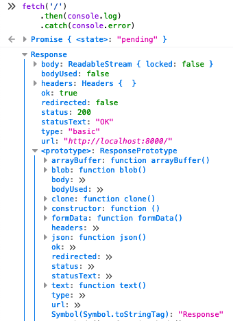
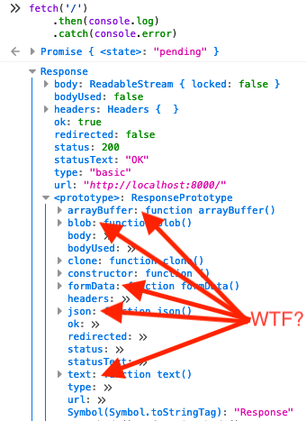

class: center, middle, inverse

# Fetch API

A brownbag deep-dive at


by Seth House

@whiteinge<br>
seth@eseth.com

---

class: center, middle

# Prerequisites

(Topics we won't be covering today.)

---

## Promises

---

class: image-slide
background-image: url(./using-fetch.png)

## [Using Fetch](https://developer.mozilla.org/en-US/docs/Web/API/Fetch_API/Using_Fetch)

---

class: center, middle

# Using Fetch

---

## `fetch(resource [, init])`

--

```js
fetch('/path/here')
    .then(console.log)
    .catch(console.error)
```

---

## `fetch(resource [, init])`



---

## `fetch(resource [, init])`

```js
fetch('https://api.github.com/users', {
    mode: 'cors',
    headers: {'Accept': 'application/json'},
})
    .then(x => x.json())
    .then(console.log)
    .catch(console.error)
```

--


---

## `fetch(resource [, init])`

```js
fetch('/path/here', {
    method: 'POST',
    body: JSON.stringify({foo: 'Foo!'}),
})
    .then(console.log)
    .catch(console.error)
```

---

## Contrast: XMLHttpRequest

```js
const req = new XMLHttpRequest();
req.addEventListener('load', function() {
    console.log(JSON.parse(this.responseText));
});
req.open('GET', 'https://api.github.com/users');
req.setRequestHeader('Accept', 'application/json');
req.send();
```

---

class: center, middle

# Fetch API

(Sister interfaces and mixins.)

---

class: center, middle

## Request

---

## `new Request(input[, init])`

Exact same API as `fetch()`!

```js
const req = new Request('https://api.github.com/users', {
    mode: 'cors',
    headers: {'Accept': 'application/json'},
})
```

--

```js
const req = new Request('/path/here', {
    method: 'POST',
    body: JSON.stringify({foo: 'Foo!'}),
})
```

---

## `fetch` accepts `Request` instances

```js
const req = new Request('https://httpbin.org/get', {
    mode: 'cors',
    headers: {'Accept': 'application/json'},
})

fetch(req).then(console.log).catch(console.error)
```

--

Useful for augmenting a request before sending it.

(Stay tuned.)

---

## `Request` accepts `Request` instances

```js
const req1 = new Request('https://httpbin.org/post', {
    mode: 'cors',
    headers: {'Accept': 'application/json'},
})

const req2 = new Request(req1, {
    method: 'POST',
    body: JSON.stringify({foo: 'Foo!'}),
})

console.log(req2.headers.get('Accept'))
// => application/json
```

--

Makes a new copy of the instance.

```js
console.log(req1.method)
// => GET
```

---

class: center, middle

## Headers

---

## `new Headers(init)`

```js
const headers = new Headers({
    'Accept': 'application/json',
    'Content-Type': 'application/json',
})
```

---

## Normalize lookups

```js
const headers1 = {'content-type': 'application/json'}
const headers2 = new Headers({'content-type': 'application/json'})

if (headers1['Content-Type'] === 'application/json') {
    JSON.parse(someJsonString)
}
// Miss!

if (headers2.get('Content-Type') === 'application/json') {
    JSON.parse(someJsonString)
}
// Hit.
```

---

## `Request` accepts `Headers`

```js
const req = new Request('/some/path', {
    headers: new Headers({'Accept': 'application/json'}),
})
```

---

## `Request` creates `Headers`

```js
const req = new Request('https://api.github.com/users', {
    headers: {'Accept': 'application/json'},
})

req.headers.get('accept')
// => application/json
```

---

class: center, middle

## Blob

---

## `new Blob( array[, options])`

* Represents a file-like object.
* Consists of the concatenation of the values in the parameter array.
* Isn't necessarily in a JavaScript-native format.

--

A tad abstract outside of niche use-cases (binary data, images, etc).

(Stay tuned.)

???

[MDN](https://developer.mozilla.org/en-US/docs/Web/API/Blob)

---

## Encapsulate data in a Blob

```js
const fileObj = new Blob(['Hello, world!'])

console.log(fileObj.size)
// => 13
```

---

## Associate a mime type

```js
const fileObj = new Blob(['{"foo": "Foo!"}'], {
    type: 'application/json',
})

console.log(fileObj.type)
// => application/json
```

---

## `Request` accepts `Blob`

```js
const req = new Request('/some/path', {
    method: 'POST',
    body: new Blob([JSON.stringify({foo: 'Foo!'})], {
        type: 'application/json',
    }),
})

console.log(req.headers.get('content-type'))
// => application/json
```

--

(!)

---

class: center, middle

## Response

---

### `new Response(body, init)`

Maybe useful for mocking an HTTP response in a unit test. Usually will come
from `fetch()`.

---

## Response body file-like objects



---

## More promises

`Response` is available as soon as the response headers finish.

The response body may yet still be streaming in, thus another promise.

---

## A note about `ok`

If `status` is in the range of 200-299.

--

Does not throw an error for non-200 responses.

--

```js
request('/some/path')
    .then(rep => {
        if (rep.ok) {
            return rep.json();
        } else {
            // A common question:
            // - throw new Error('Oh noes!')
            // - return rep.json();
        }
    })
    .catch(console.error)
```

--

Many error types. Don't conflate them!

- Network errors <span class="quiet">(timeout, blocked, cache failure)</span>.
- HTTP non-success status codes <span class="quiet">(user error, server error,
  upstream proxy error, many more)</span>.
- Uncaught JavaScript errors <span class="quiet">(application bugs, unparseable
  JSON)</span>.

---

## REST APIs and success or failure

```http
HTTP/1.0 200 OK
Content-Type: application/json

{"error": true, "message": "Bad Request", "data": "Username taken."}
```

vs.

```http
HTTP/1.0 400 Bad Request
Content-Type: application/json

{"data": "Username taken."}
```

--

But that's another rant...

---

class: center, middle

# Interlude

Why using file-like objects is a genius idea.

---

## Uploads

`File` interface is based on `Blob`

```html
<input type="file" onchange="((ev) => {
    fetch('https://httpbin.org/anything', {
        method: 'POST',
        body: ev.target.files[0],
    })
})(event)">
```

--

Associates mime type automatically.

Note: this is based on a small, hard-coded list of file types in the browser
and then falls back to file associations in the OS. For example, you may get
a different mime type for a CSV file on Windows if Microsoft Excel is installed
or not.

---

## Pop-ups

```html
<button type="button" onclick="((ev) => {
    fetch('https://httpbin.org/image', {
        headers: {accept: 'image/webp'}})
    .then(x => x.blob())
    .then(blob => window.open(window.URL.createObjectURL(blob)))
})(event)">Show me!</button>
```

--

Associates mime type with window contents automatically.

PDFs will open in default PDF viewer, images will render, HTML content will be
parsed, text content will display, etc.

---

## Downloads

```html
<button type="button" onclick="((ev) => {
    fetch('https://httpbin.org/image', {
        headers: {accept: 'image/webp'}})
    .then(x => x.blob())
    .then(blob => {
        const el = document.createElement('a');
        el.setAttribute('href', window.URL.createObjectURL(blob));
        el.setAttribute('download', 'myimage.webp');
        el.click();
    })
})(event)">Download me!</button>
```

--

Download from the server, store in-memory, then prompt the browser to save the
file.

---

## Form Submission

```html
<form
    onsubmit="((ev) => {
        ev.preventDefault();
        fetch('https://httpbin.org/post', {
            method: 'POST',
            body: new FormData(ev.target),
        });
    })(event)"
    method="POST"
>
    <input type="text" name="foo" value="Foo!" />
    <input type="text" name="bar" value="Bar!" />
    <button type="submit">Submit</button>
</form>
```

--

Associates mime time as `multipart/form-data` automatically.

---

## Get string data out of a Blob

tl;dr: modern APIs are in [working
draft](https://w3c.github.io/FileAPI/#dom-blob-text) (and also seem
incomplete).

--

Current API:

```js
const myBlob = new Blob(['Foo!'])
const f = new FileReader()
f.onload = () => { console.log(f.result) }
f.readAsText(myBlob)
// => Foo!
```

--

New API (some support in evergreens):

```js
const myBlob = new Blob(['Foo!'])
myBlob.text().then(console.log)
// => Foo!
```

---

class: center, middle

# Conclusion

---

## Fetch API

The Fetch API is a tight ecosystem of classes and mixins, not only `fetch()`.

---

## Ajax wrappers

No real application operates without a custom wrapper around the ajax lib...

* Abstract boilerplate request formatting:
  * Add common request headers.
  * Send request as JSON.
  * Authenticate requests: <span class="quiet">(add auth header or opt-in to
    sending cookies).</span>
  * Enable CORS.
  * Send XSRF token.
* Consistent response parsing:
  * Parse as JSON.
  * Handle redirects: <span class="quiet">301 (Permanent), 302
    (Temporary).</span>
  * Handle no-content responses: <span class="quiet">201 (Created), 202
    (Accepted), 204 (No Content).</span>
  * Handle authorization responses: <span class="quiet">401 (Unauthorized), 403
    (Forbidden).</span>
  * Success vs error responses: <span class="quiet">400 (Client Error), 404
    (Not Found), 409 (Conflict),<br>500 (Server Error), 502 (Gateway
    Unavailable), 503 (Service Unavailable).</span>
* Response caching & conditional-GET requests: <span
  class="quiet">If-None-Match/If-Modified-Since, 304 (Not Modified).</span>

---

## Fetch API

...but `fetch()` is the most minimal one I've seen.

--

_If_ you embrace the Fetch API norms and ecosystem:

```js
// Avoid this common pattern:
myajaxwrapper('/some/path',
    {foo: 'Foo!', /* automatically JSONify this arg */})

// Instead encode outside the wrapper as a file-like object:
myajaxwrapper('/some/path', tojson({foo: 'Foo!'}))
```

Where:

```js
const tojson = data => new Blob([JSON.stringify(data)],
    {type: 'application/json'})
```

---

## Yet Another Fetch Wrapper

```js
const request = (...args) => {
  const req = new Request(...args, { credentials: 'include' })
  req.headers.set('X-CSRF-Token', 'secret!')

  return fetch(req)
    .catch(console.error /* log network error to HB */)
    .then(redirect401sToLoginPage)
}
```

--

Input API is _identical_ to `fetch()`!

The wrapper is robust and flexible yet simple.

---

## Yet Another Fetch Wrapper (usage)

```js
request('/some/path', { method: 'POST', body: tojson(someData) })
  .then(rep =>
    rep.json().then(data => {
      if (rep.ok) {
        // Do success thing with data.
      } else {
        // Do error thing with data.
      }
    }),
  )
  .catch(console.error /* log uncaught JS error to HB */)
```

--

...the output API lacks that same elegance.

Handling varied return types is cumbersome, though those APIs are being worked
on.

Several design flaws in Promises also contribute (non-lazy, silently swallow
errors, forgetting to return a nested promise).
