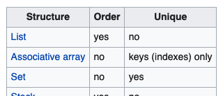
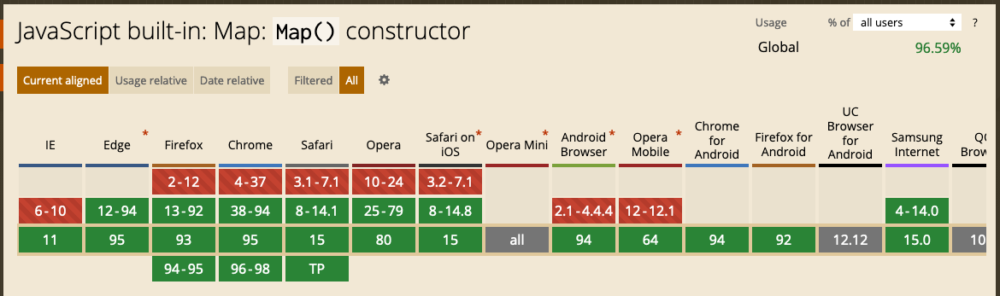

class: center, middle, inverse

# cssinjs

A brownbag Q&A at


by Seth House

@whiteinge<br>
seth@eseth.com

---

class: center, middle

# A (little) history

---

## Glamor vs &lt;insert lib here&gt;

--

* Discussed multiple times in the last few years.
--

* Teams have "CSS rewrite" fatigue.
--

* Rewriting CSS across all our FE projects is an _enormous_ undertaking.
--

* Outlier CSS implementations:
--

  * Increase friction for cross-team "developer borrowing",
--

  * and for cross-team developer transfers;
--

  * Increase technical debt across MX.

---

## Why Glamor?

* (Very, very) Simple API:  
  `const className = css({ })`
--

* No build-time or editor tooling needed.
--

* Common API with a handful of other libs.
--

* Very close to writing vanilla CSS <span class="quiet">(but with
  namespacing)</span>.
--


Why not Glamor?
--

* Unmaintained.
--

* Large number of deps were a problem.
--

* Some API aspects were something we wanted to avoid using.
--

* Payload size could be improved.
--

* Styles bleed "downward" <span class="quiet">(namespacing is an imperfect
  encapsulation)</span>.

---

## So we're stuck with the Glamor API?

--

No. MX encourages exploration.
--

* Data driven!
--

* Write a proposal (RFC).
--

* Define *objective* success criteria and a timeline.
--

  <span class="quiet">(Subjective proposals should be rare and have
  overwhelming cross-team support.)</span>
--

* Once the proposal is greenlit, run the experiment for the allotted time.
--

* Evalutate the results according to the success criteria.
--

* Teams at MX will start to adopt the accepted new tech.
--


<span class="quiet">My guess: since we've dropped IE11 support our next pivot
will be "the platform".  
CSS variables for Kyper tokens, Shadow DOM for encapsulation.</span>

---

class: center, middle

# cssinjs

https://github.com/mxenabled/cssinjs/

???

More background:

https://github.com/mxenabled/mx-react-components/issues/897

---

## A wrapper library

* Not _Yet Another CSS-in-JS Library_.
--

* ~45 SLOC wrapper around
  [Free-Style](https://github.com/blakeembrey/free-style),
--

* ...which is a ~300 SLOC library with zero dependencies.
--

* Goal: zero maintenance, zero fuss.
--

* Glamor API-compatible <span class="quiet">(excepting the following
  caveats)</span>.
--

* Please read the `README`
--

  <span class="quiet">(please)</span>.

---

## Thank you!

* Kyper Team.
--

* Jared Gerlach.
--

* David Alger.
--

* Peter, Maddie, Sam, & several others.

---

## Caveat: order-dependent styles

--

```js
// Doesn't work:
css({
  borderTop: '1px solid',
  borderColor: 'blue',
})

// Works (but still not a good idea):
css({
  borderRight: '1px solid',
  borderColor: 'blue',
})
```

Why?

---

class: center, middle

## Interlude:

### Data Structures

---

## Data structures

<span style="font-size: 55%;">(a,b)-tree, 2-3 heap, 2-3 tree, 2-3-4 tree, AA
tree, AF-heap, AList, AVL tree, Abstract syntax tree, Adaptive k-d tree,
Adjacency list, Adjacency matrix, Alternating decision tree, And-inverter
graph, And-or tree, Array, Array list, Association list, Associative array,
B sharp tree, B\*-tree, B+ tree, B-heap, B-tree, BK-tree, BSP tree, Beap, Bin,
Binary decision diagram, Binary heap, Binary search tree, Binary tree, Binomial
heap, Bit array, Bit field, Bitboard, Bitmap, Bloom filter, Bounding interval
hierarchy, Bounding volume hierarchy, Brodal queue, Bx-tree, C tree, Cartesian
tree, Circular buffer, Collection, Compressed suffix array, Conc-tree list,
Container, Control table, Count-min sketch, Cover tree, Ctrie, D-ary heap,
Dancing tree, Decision tree, Difference list, Directed acyclic graph, Directed
acyclic word graph, Directed graph, Disjoint-set, Disjoint-set data structure
(Union-find data structure), Distributed hash table, Dope vector, Double
hashing, Double-ended priority queue, Double-ended queue, Doubly connected edge
list also known as half-edge, Doubly linked list, Dynamic array, Dynamic
perfect hash table, Enfilade, Expectiminimax tree, Exponential tree, Expression
tree, FM-index, Fenwick tree, Fibonacci heap, Finger tree, Free list, Fusion
tree, Gap buffer, Generalised suffix tree, Graph, Graph-structured stack, Hash
array mapped trie, Hash list, Hash table, Hash tree, Hash trie, Hashed array
tree, Heap, Hilbert R-tree, Hypergraph, Iliffe vector, Image, Implicit k-d
tree, Interval tree, Judy array, K-ary tree, K-d tree, Koorde, Left-child
right-sibling binary tree, Leftist heap, Leonardo heap, Lexicographic Search
Tree, Lightmap, Linear octree, Link/cut tree, Linked list, List, Log-structured
merge-tree, Lookup table, M-tree, Map, Matrix, Merkle tree, Metric tree,
Min/max k-d tree, MinHash, Minimax tree, Multigraph, Multimap, Multiset,
Octree, Order statistic tree, Pagoda, Pairing heap, Parallel array, Parse tree,
Piece table, Prefix hash tree, Priority queue, Propositional directed acyclic
graph, Quad-edge, Quadtree, Queap, Queue, Quotient filter, R\* tree, R+ tree,
R-tree, R\* tree, R+ tree, Radix tree, Randomized binary search tree, Range
tree, Rapidly exploring random tree, Record, Red-black tree, Relaxed k-d tree,
Retrieval Data Structure, Rolling hash, Rope, Rose tree, Routing table,
SPQR-tree, Scapegoat tree, Scene graph, Segment tree, Self-balancing binary
search tree, Self-balancing tree, Self-organizing list, Set, Skew heap, Skip
list, Soft heap, Sorted array, Spaghetti stack, Sparse matrix, Splay tree,
Stack, Suffix array, Suffix tree, Symbol table, T-tree, Tagged union, Tango
tree, Ternary heap, Ternary tree, Threaded binary tree, Top tree, Treap, Tree,
Trie, Tuple, UB-tree, Union, Unrolled linked list, VList, VP-tree, Van Emde
Boas tree, Variable-length array, WAVL tree, Weak heap, Weight-balanced tree,
Winged edge, X-fast trie, X-tree, XOR linked list, Xor linked list, Y-fast
trie, Z-order, Zero-suppressed decision diagram, Zipper, bag, discriminated
union, disjoint union, structure, variant, variant record.</span>

???

https://en.wikipedia.org/wiki/List_of_data_structures

We don't think much about data structures in JS (or in high-level languages
more generally). In the distant past, or for certain performance-critical
applications today, choosing the right data structure is often 80% of the whole
problem.

Each data structure has different characteristics, different performance
optimizations or considerations, and different use-cases.

---

## Associative array

Associative array,
--

dictionary,
--

hash table,
--

hash map,
--

table (etc).

--

```js
const MyObject = {
    foo: 'Foo!',
    bar: 'Bar!',
}
```
--


--


Optimized for fast _lookup_. Not traversal, not insertion order, not search,
etc.
--


JavaScript, Python, Ruby, C#, Java, Lua, others -- all _unordered_!
<span class="quiet">\*</span>

---

### Explore data structure characteristics

```js
console.log('Generating big data structures...')
var uniqueId = () => (Math.random() + 1).toString(36).substring(2)
var BigArray = Array.from({length: 1000000}, () => uniqueId())
var BigObject = Object.fromEntries(BigArray.map((x, i) => [x, i]))
var firstItem = BigArray[0]
var lastItem = BigArray[BigArray.length - 1]
console.log('...done. Starting lookups:')

console.time('Array traversal (first)')
BigArray.find(x => x === firstItem)
console.timeEnd('Array traversal (first)')

console.time('Array traversal (last)')
BigArray.find(x => x === lastItem)
console.timeEnd('Array traversal (last)')

console.time('Object lookup (first)')
BigObject[firstItem]
console.timeEnd('Object lookup (first)')

console.time('Object lookup (last)')
BigObject[lastItem]
console.timeEnd('Object lookup (last)')
```

---

## Insertion-order-preserving structure

```js
const MyMap = new Map();
MyMap.set('foo', 'Foo!');
```
--

> The keys in Map are ordered in a simple, straightforward way: A Map object
> iterates entries, keys, and values in the order of entry insertion. 
>
> -- [MDN](https://developer.mozilla.org/en-US/docs/Web/JavaScript/Reference/Global_Objects/Map)

--



--


Python, Ruby, C#, Java, Lua, and others also have separate order-preserving
structures.

---

## <span class="quiet">\*</span> Well actually...

--

* JS added preservation of insertion order to _some_ `Object` internals to the
  ES5 spec, then more in ES2015, and more in ES2020.
--

* Common JS engines have largely implemented those specifications now.
--

* Python and Ruby have recently(!) made similar order-preserving changes to the
  base data structure.
--

* Is all this advice now antiquated?

---

## Caveat emptor

--

* Unordered associative arrays have a long history and change happens slowly.
--

* Are JavaScript, Python, & Ruby setting a new long-term trend? Or will they be
  outliers?
--

* May be confusing if you find yourself in another language in the future.
--

* Order preservation may not survive serialization.  
  <span class="quiet">(Requires order-preserving support in both the source and
  target languages, plus any intermediaries, plus the serializer/deserializer
  implementations. Semantics may (will!) differ beteween serialization formats
  (JSON, XML, protobuf, etc).)</span>
--

* Additional interoperability concerns on unusual or niche JS engines.  
  <span class="quiet">(Embedded devices, games, inside other programs (Excel, PDFs,
  etc)</span>.)
--

* Third-party libraries may target different browsers than you do and handle
  ordering explicitly.  
  <span class="quiet">(E.g. the CSS library that we are
  currently using, and React (as a console warning).)</span>
--

* We have usable order-preserving-specific data structures.

---

class: center, middle

## Interlude Concluded

---

## Caveat: order-dependent styles

```js
// Bad:
css({
  borderTop: '1px solid',
  borderColor: 'blue',
})

// Good:
css({
  borderRightWidth: '1px',
  borderRightStyle: 'solid',
  borderColor: 'blue',
})
```

--
Free-Style sorts object keys lexicographically (alphabetically) in order to
produce a deterministic hash across many JS environments.

--

Feel free to mix-and-match longhand and shorthand CSS styles! However, beware
order-dependent styles.

---

## Aside: inline styles too

```js
<div style={{
    borderTop: '1px solid',
    borderColor: 'blue',
  }}>
    Hello, world.
</div>
```
--

React 16.13.0+ detects potentially conflicting styles and throws a warning.

???

https://reactjs.org/blog/2020/02/26/react-v16.13.0.html#warnings-for-conflicting-style-rules
