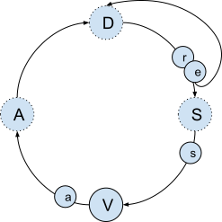

class: center, middle, inverse

# Redux Boilerplate

A brownbag deep-dive at


by Seth House

---

## State management?

--

- 🌐 Global state atom,  
  👱 Composable individual state atoms.
--

- 📦 Encapsulated state,  
  🍃 Freely accessible state.
--

- 🔃 Data lifecycles.
--

- 👀 Aware of downstream consumers.
--

- 📐 Principled access.
--


Mgmt        | 🌐 👱 | 📦 🍃 | 🔃  | 👀    | 📐
------------|-------|-------|-----|-------|------
Component   | 👱    | 📦    | ✅  | ✅    | ⛔ \*
Redux       | 🌐    | 🍃    | ⛔  | ⛔    | ✅ 
Context     | 👱 \* | 🍃    | ⛔  | ⛔ \* | ⛔ 


???

Classifying state management approaches is very difficult. There are many
approaches, each with wildly varying characteristics.

A plain JavaScript object provides very little functionality out-of-box,
however much can be layered on top of it.

For example, a global state atom can be a simple as a JavaScript object that
you mutate directly. The data is easy to read and easy to write. However you
have no way to track when data has changed or what data has changed. You have
no idea who is referencing which data.

If you wrap that object in getter and setter functions you can know when data
is changed.

Instead of mutating directly, if you are careful only to change the data using
reducer functions that replace data with shallow copies of the changed data you
can know when data is changed and what data is changed.

Instead of reducer functions, if you use a lens library to replace data you can
know when data is changed, which data is changed, and you can have some
visibility into who is interested in which parts of the data and add lifecycle
management to clean up unused data.

It's the same JavaScript object but _how_ you access it requires more care,
more complexity, and more knowledge, but also enables more sophisticated usage.

In contrast:

An immutable data structure library can use complex internal data structures to
mimic data stored in an object but provide strict guarantees and visibility
into the data within.

A collection of observables can store individual bits of data and be combined
arbitrarily to produce a large composition of data needed to render a web page.
Subscribers to those observables provide granular information about whether
that data is used or unused and by whom.

A state machine library can encapulate internal state and only provide access
to it through well-defined interfaces, and changes to that data must adhere to
specific, strict business logic workflows that can only ever produce internally
consistent values.

---

class: center, middle

# The Flux pattern

---

## User interface architectures

- MVC
- MVP
- MVT
- MVVM
- MVI
- Flux
- BEST
- MVU

[...etc](https://staltz.com/unidirectional-user-interface-architectures.html).

???

They are legion. Is Flux the best? Probably not but it works fine.

---

## Flux

.left-column[

]

.right-column[
D - Dispatcher  
S - Store  
V - View  
A - Actions  
]

???

Dispatcher:

- Central choke-point to coordinate actions. This coordination is either to
  make them execute serially, or to check/satisfy a dependency hierarchy before
  publishing an action out to many subscribers.
- Central point to monitor all changes to the data.
- All data must enter the system through the dispatcher to ensure
  a deterministic store result (such as for writing tests or reproducing bugs).

Store:

- The data.
- Often a global object containing all values, often namespaced under keys for
  organzation, but this is an implementation detail and not a requirement.
  Individual stores that combine into a whole is also possible.
- How this data is modified over time is an implementation detail (reducers,
  observables, lenses, immutable-like libraries, etc).
- Usually has a way to inform interested parties (subscribers) of changes to
  the data, though not necessarily _which_ data has changed.
- Becuase the same data can be referenced by many downstream places it is often
  useful to treat this data generically, as though it was a denormalized
  database, rather than structuring it for a specific view or use-case. Those
  use-cases can be satisfied by _deriving_ view-specific data in
  a performance-concious way.

View:

- A function that transforms a data structure (usually a specific subset of the
  store) into a different data structure that the browser can render natively.
  (Usually by way of a templating engine, or a declarative API that can produce
  DOM nodes (JSX).)

Actions:

- A description of something that happened (past tense) in the system. E.g.,
  "the page says to start loading the data", "the data is loaded, oh and here
  it is", "the user clicked a thing".
- Informational only. No logic or behavior. (Light data formatting, or async
  operations (thunks) should be done in action creators, not actions.)
- If the data is all JSON serializable it can be easily reused elsewhere such
  as generating bug reports of user actions, or written to local storage, or
  sent over the wire via ajax.
- Usually given a unique identifier and coupled with any data about the action
  being described that the rest of the system needs to fulfil the request.
- Actions are usually not reusable. If two things are clicked that ultimately
  produce the same end result, it's still useful to distinguish which of the
  two things was clicked -- e.g., debugging which thing happened, ability to
  vary behavior between the two things over time (do X, but now also do Y). But
  most often the end result is not actually the same -- e.g., say you have
  a `closeModal` action that closes a modal when the close button is clicked,
  and now you also want to close a modal when the page is navigated away from;
  it's the same end-result (modal is closed), but in a different context and
  very likely with some additional behavior (also reset other state variables
  to the default values since the page is being closed).

---

## Redux

.left-column[

]

.right-column[
D - Dispatcher  
S - Store  
V - View  
A - Actions  
r - reducers  
s - selectors  
a - action creators  
]

???

### Variations on Flux:

Dispatcher:

Technically exists but is downplayed by the Redux docs and community. Ensures
serial execution of actions.

Store:

Global object, usually with namespaced sub-sections for organization purposes
but this is not a requirement. The store is not exposed directly and must be
changed via reducer functions and retrieved via a getter method.

### Additions to Flux:

Reducers:

- A reduce function from old state to new state.
- JavaScript does not have immutable data structures or a way to monitor an
  object for changes (`Object.observe` failed proposal) so we must modify the
  data such that we can cheaply(!) compare before/after. This is usually done
  by _convention_ by making a crap-ton of shallow copies when modifying.
  Expensive on-write (and the garbage collector), but cheap on-read (usually
  via `===` identity checks). In Redux this is critical because those checks
  happen _a lot_ throughout the component tree and elsewhere.

Actions:

Ideally JSON-serializable but not required. The Redux devtools will display
JSON data natively. Non-JSON data is simply not shown and large objects can
cause performance slowdowns with the devtools. This can be fixed by providing
an `actionSanitizer` function that checks for certain kinds of objects (like
React SyntheticEvents) and returns a simpler representation that will work in
the devtools.

Action creators:

- A function that produces an action.
- Provides a place to modify or format data from the view before it is received
  and processed by a reducer (or a middleware).
- Middleware can be provided to post-process the output of action creators so
  they can output things besides actions, such as functions (thunks) or
  promises or others, that will (eventually) produce actions.
- Often cited as a way to decouple a view from having to know too much about an
  action (usually to ease testing). This advantage is often overstated since
  the view must provide the payload in the first place. A constant can be an
  equally fine alternative if the data doesn't require too much formatting or
  logic -- e.g. extracting a value from an event handler.

Selectors:

- A (usually) memoized function that intercepts data from the store and
  reformats it, or combines it with other data from the store, in order to
  produce derived data or reformatted data that is easier to work with in
  a specific view.

---

## redux-thunk

.left-column[

]

.right-column[
D - Dispatcher  
S - Store  
V - View  
A - Actions  
r - reducers  
s - selectors  
a - action creators  
t - thunks  
]

--

```js
const myAction = (payload) => (dispatch) =>
    MyAPI.someCall(payload).then(rep =>
        dispatch({
            type: ActionTypes.SOME_ACTION,
            payload: rep.body,
        }))
```

???

Thunks are a function that, when executed, usually begins an asynchronous
process that will emit an action once complete. They are simple, by design, and
have the benefit of making a promise "lazy" by wrapping it in a function.

---

## redux-thunk (warning)

.left-column[

]

.right-column[
D - Dispatcher  
S - Store  
V - View  
A - Actions  
r - reducers  
s - selectors  
a - action creators  
t - thunks  
]

```js
// Don't return a Promise from an action creator.
const myAction = (payload) => (dispatch) => {
    MyAPI.someCall(payload).then(rep =>
        dispatch({
            type: ActionTypes.SOME_ACTION,
            payload: rep.body,
        }))
}
```

???

Returning a promise from an action creator allows users to do promise-chaining
directly in a view. Convenient, yes, but it entirely sidesteps the Flux data
flow.

---

## redux-observable

.left-column[

]

.right-column[
D - Dispatcher  
S - Store  
V - View  
A - Actions  
r - reducers  
s - selectors  
a - action creators  
e - epics
]

--

- Reducers and Epics are peers.
- Both are appropriate for business logic. (Be consistent.)

???

Epics are always-on observable streams that listen to all actions the
dispatcher emits, filter just the ones of interest, perform various
asynchronous effects, and then emit zero-or-more actions. They are decoupled
and run independently of the rest of Redux. For example, a "heartbeat" epic
could start an internal timer when the app is first started and emit periodic
actions throughout the life of the app, independent of receiving any external
actions.

---

## Component state

.left-column[

]

.right-column[
D - Dispatcher  
S - Store  
V - View  
A - Actions  
r - reducers  
s - selectors  
a - action creators  
]

???

Component state is simple and convenient. It can be organized/architected for
more complex data management however doing so requires careful planning, glue
code or libraries that live outside of the React package.

A huge benefit of component state, and one that is very hard to replicate in
external state management libraries, is the component lifecycle means you can
always know what state data is used, by whom, and when it is no longer used
(and can be cleaned up).

---

class: image-slide, image-slide-tall

background-image: url(./img/tree.png)

???

Component state has a lot of benefits and one huge drawback that _effectively_
ruins it.

A hierarchical tree of components is a different kind of thing than state or
behavior, yet the latter two are completely constrained by the _arbitrary_
placement of where they live in that tree.

If you've ever written CSS and had to rearrange or wrap DOM nodes in order to
make the styling work then you're already familiar with this same problem from
another context. CSS has massively improved over the last 20 years. Perhaps
there's hope for component state yet.

This is often hand-waved as "prop drilling sucks" or simply bypassed entirely
by Context or Redux (effectively throwing the baby out with the bathwater), but
there hasn't been enough exploration about how to provide better messaging
between components across branches.

In the early days of React there was a lot of excitment around component state
and how to build an application from these encapsulated pieces. Higher-order
components, controller components, render props, reducer props (*shudder*),
etc. After a couple years people were so sick of this they largely abandoned
ship in favor of Flux and Redux. The Hooks API has reinvigorated excitement
around component state...with a syntactical change and without solving any of
the problems.

The DOM API does not provide many examples to work from, however the `<form>`
tag is one. It has access to and manages the form fields that are encapsulated
inside it such that _where_ those fields live is irrelevant, only that they're
encapsulated somewhere. Then data from the form contents is accessible to the
form itself, such as whether the form is valid or not (whether it contains any
invalid form fields or not).

Can you make it work? Absolutely! Component state, like violence and XML, can
solve your problem if you use enough of it. Does doing so provide the best
result for readability, discoverability, and maintainability? Maybe! However
that goal becomes more complex because you're trying to match semantic
structure with behavior and state, rather than managing behavior and state
independently and then later applying those to an arbitrary structure.

"Reuse" and "composition" are words often rasied in the React community as
a benefit of the component API. But a component isn't one thing. A component is
made from one or more of many kinds of things:

- Semantic structure.
- CSS Styles.
- Reaction to user behavior (events).
- Data fetching.
- Data caching.
- Error handling.
- Props as:

  - Component attributes (configuration).
  - Message passing (parent-to-child via changing props).
  - Message passing (child-to-parent via passing a function the child must
    (know how to) call).
  - Function arguments (data).
  - Component styles.
  - Child-component styles (themes).
  - Other components (HoC).
  - Render functions.
  - State management functions.
  - Tunneled through wrapper components to distant children.

Any one of those things is reusable or composable with more of that same thing,
but none of those things are composable with a different one of those things.

tl;dr:

Components _can_ do a lot of things. We have _not_ figured out how to organize
or compose them into a maintainable app.

---

class: center, middle

# Redux

---

## Redux features


???

How many Redux users actually use Redux for data hydration, or time-travel
debugging, or hot-reloading, or serialized actions for automated bug reports,
or to maintain an undo history, or etc...etc. Those are benefits if you need
them (and are willing to spend the time to wire your app to use them) but most
blog posts confuse the two or are only talking about Redux as a model of data
flow.

---

## Why use Redux?

--

- Principled state management.

--

- Everything else is an _implementation detail_.

--

- Alternatives?

--

  - .quiet[Alt, Barracks, Delorean, disto, fluce, fluctuations, Flummox, Flux,
    Flux This, Fluxette, Fluxible, Fluxxor, Fluxy, Lux, Marty.js, Material
    Flux, McFly, microcosm, microflux, mmox, Nuclear.js, NuclearJS,
    OmniscientJS, Reducer, Redux, Reflux. (Flux variants circa 2015)]

--

  - Other state management libraries? _Literally thousands_.

--

- ...often overlooked: Async support (via middleware).

???

noun A rule or standard, especially of good behavior.

Obvious testing, obvious debugging, predictable code locations for business
logic, effects, and triggers for both.

---

## "You might not need Redux"

--


--


--


???

Saying "local state is fine" is the same thing as saying "state is fine" --
which is the same thing as saying "fire is useful" -- entirely
context-dependent. Local state is fine if the code to manage it is organized,
discoverable, predictable, and easy to understand and maintain. The reason that
isn't a more common talking-point is local state is by definition smaller than
application state and small messes are easier to overlook individually. However
a bunch of small messes are (at least) as intractable as one large mess.

---

## Redux features vs conceptual model

--


vs


???

Often when people talk about whether you "need" Redux they're rarely talking
about specific Redux features but rather talking about introducing Redux as
a conceptual model. This is a useful distinction.

Even Dan (sometimes) falls into this trap. All the points made in his [You
Might Not Need
Redux](https://medium.com/@dan_abramov/you-might-not-need-redux-be46360cf367)
post are implementation details. If you want/need those features then great but
those _are not_ the core idea. In contrast, he makes a great pitch for Redux
when [pitching the value of
Flux](https://medium.com/swlh/the-case-for-flux-379b7d1982c6).

---

## "When" do you need Redux?

--

- When multiple non-ancestor components need the same state.

--

  .quiet[No: context; controller components; render reducers.]

--

- When you're prop-tunneling more than `N` layers deep.

--

  .quiet[No: context; how many layers is `N`?]

--

- When you have cascading renders, or render race conditions, or render
  performance problems.

--

  .quiet[No: find the errors and fix them; they will eventually show up in
  other contexts.]

--

- When promises resolve after a component unmounts.

--

  .quiet[No: this is not a React problem (vanilla DOM API too); program more
  defensively; use XHR instead of Fetch (cancellable); use Observables.]

--

- To make React "scale".

--

  .quiet[No: Redux has scaling considerations too...as does all of software.]

---

## "When" don't you need Redux?

--

- When you only need "component state" or "view state".

--

  .quiet[Define the boundary between "view state" and "application state".]  

--
  .quiet[(Hint: there isn't one.)]

--

- Start with component state and move it to Redux if/when you need to.

--

  .quiet[
  Possible:

  - _Purposefully_ model component state with the reducer pattern.
  - Rely on external data via actions.
  - _Never_ use external data (like from other Hooks).
    - This means no API calls (the `useEffect` execution semantics are too
      different).


  Otherwise a refactoring nightmare.
  ]

---

## Redux isn't needed anymore

- "Just use context."
- "Just use Hooks."
- "useState is so much simpler."
- "useReducer is the same thing."
- "Context + useReducer is Redux."

---

### Context

--

- Often overblown.
--

- Simple publish/subscribe .quiet[(good)], buried inside a component API .quiet[(bad)].
--

- Use as you would a module-level variable, but with React machinery instead of
  JavaScript machinery.
--

- Principled state management is (entirely) up to you.
--

- (react-redux uses it as an implementation detail.)
--

- Good for side-loading external data...when you have a small number of
  individual contexts.  
--

  <a href="https://twitter.com/ericnormand/status/1515710592014819328">
  
  </a>

???

Context has all the drawbacks of both component state and of Redux-esque
global state, but with none of the benefits of either.

Drawbacks:
- Still tied to the component hierarchy.
  - Both the provider and the consumer must opt-in to making a given value
    available. It's (obviously) easier to move data up and down the component
    hierarchy but how often do people just put it at the top and avoid the
    hassle? In which case, what was the point?

Missing benefits:
- Principled state management (out-of-box).
- Unaware of component life cycle.
- Component API means it cannot be used outside of React components.

---

### Hooks

- Nice, succinct API.
- Entirely dependent on very specific React internal behavior.
- Still new and unproven for long-term maintenance. Beware the hype.

---

### `useState`

- No principled data management.
- Usually said by developers who started with React after hooks were introduced
  and who don't have experience with class component patterns for wrangling
  component state.

---

### `useReducer`

- The reducer pattern applied to component state.
- Good for organizing data in a single component.
- Possible to reuse across multiple components (with work).
- No side-loading data.
- Async possible via action creator wrappers around `dispatch` (thunks-like
  usage).

---

### Context + `useReducer`

- Contender with caveats.
--

- Can recreate Redux using React-specific APIs.
--

- Small to implement; no need for react-redux addition.
--

- Async possible via thunk-like "middleware" wrapper function around
  `dispatch`.
--

- Entirely dependent on several independent React machineries:
  - Cannot use outside of React _context_.
  - Cannot use outside of React _components_.
  - Cannot use outside of React _hooks_.
--

- Testing? Yes for the reducer. No for the action creators, actions, or thunks.  
  .quiet[(Needed parts are hidden inside the Hooks execution sandbox.)]
--

- Worth investigating?

???

Context provides a kind of dependency-injection instead of hard-coded imports,
which may be useful. Unfortunately that relies on React machinery when
unit-testing, same as import interception, so have we gained testability?

https://nikhilkumaran.dev/blog/you-dont-need-redux

---

## Why do _we_ use Redux?

- Popular Flux implementation.
- Well documented.
- Lots of support options.

---

## Why is popularity waning?

- Boilerplate.
- Hooks hype (component state revival).
- Missing features & downsides.

---

## What are the downsides?

--

- Simple.
--

- Unware of component life cycle. .quiet[(No initialization. No clean-up.)]
--

- Unware of who is using what data. .quiet[(No remove unused data.)]
--

- Global store:
--

  - "Normalize the store." .quiet[(Hard.)]
--

  - Can get messy if everyone can see (and change) everything.
--

  - Namespacing (`combineReducers`) makes a global store _optionally_ global.
--

  - Reducers can't differentiate between "state owner" and "interested parties". .quiet[(Read/write vs read-only.)]
--

- No (direct) correlation between action and state-change. .quiet[(Dev Tools hack around this.)]
--

- Debugging indirection. .quiet[(Dev Tools action -> action creator -> action constant -> reducer or epic. Then somehow find which state is used by which component.)]
--

- Can't update state without triggering renders.
--

- Effects management is 2nd-class.  
--

  

---

class: center, middle

# Deconstructing Redux

---

## Why deconstruct?

- Redux (and/or React) often introduced via create-react-app (et al).
- Feels complex when it shouldn't.
- Reducing/removing "magic" helps you make informed decisions.

--
- If you don't understand the 'why' then you end up following the patterns
  regardless if they're helpful or not in a given situation.

---

## `map`, `filter`, `reduce`

```js
const oldArray = [0, 1, 2, 3, 4]
```
--

```js
const newArray = oldArray.map(x => x + 1)
// [ 1, 2, 3, 4, 5 ]
```
--

```js
const evensArray = oldArray.filter(x => x % 2 === 0)
// [ 0, 2, 4 ]
```
--

```js
const totalCount = oldArray.reduce((acc, cur) => {
    acc += cur
    return acc
}, 0)
// 10
```

---

## The 'reducer' pattern

```js
const oldState = {count: 0}

const actions = [
    {type: 'INC', payload: 1},
    {type: 'DEC', payload: -1},
    {type: 'INC', payload: 1},
    {type: 'INC', payload: 1},
]

const newState = actions.reduce((acc, cur) => {
    return {...acc, count: acc.count + cur.payload }
}, oldState);

// { count: 2 }
```

---

class: image-slide

## Redux example

```js
await import('https://unpkg.com/redux@4.1.2/dist/redux.js')

// Actions
const A = { INC: 'INC', DEC: 'DEC' }

// Store
const defaultState = {count: 0}
const myReducer = (state = defaultState, action) => {
  switch (action.type) {
    case A.INC: return { ...state, count: state.count + 1 }
    case A.DEC: return { ...state, count: state.count - 1 }
    default: return state
  }
}
const Store = Redux.createStore(myReducer)

// View
const myView = (props) => `<div>My Counter: ${props.count}.<br>
  <button onclick="((ev) =>
    Store.dispatch({ type: A.INC }))(event)">+</button>
  <button onclick="((ev) =>
    Store.dispatch({ type: A.DEC }))(event)">-</button>
</div>`

// App
document.body.innerHTML = myView(Store.getState())
Store.subscribe(() =>
  document.body.innerHTML = myView(Store.getState()))
```

---

## react-redux (classes)

```js
const connect = (config) => (MyComponent) => {
    class MyWrapper extends React.Component {
        componentDidMount() {
            this.sub = Store.subscribe(() => {
                this.latestState = Store.getState()
                this.forceUpdate()
            })
        }

        componentWillUnmount() {
            this.sub.unsubscribe()
        }

        render() {
            return React.createElement(MyComponent,
                this.latestState)
        }
    }
}
```

---

## react-redux (hooks)

```js
const useSelector = fn => {
  var latestState = useRef(fn(Store.getState()))
  var [_, forceRender] = useState(0)

  useEffect(() => {
    const sub = Store.subscribe(() => {
      latestState.current = fn(Store.getState())
      forceRender((c) => (c + 1) % 10)
    }

    return () => sub.unsubscribe()
  }, [])

  return latestState.current
}
```

---

class: image-slide

## `createStore`

```js
const createStore = (reducer, initialState) => {
  let _state = initialState
  let _subscribers = []
  
  const ret = {
    getState: () => _state,
    dispatch: (action) => {
      const newState = [action].reduce(reducer, _state)
      console.log(action.type, {action, oldState: _state, newState})
      if (newState !== _state) {
        _state = newState
        _subscribers.forEach((cb) => cb())
      }
    },
    subscribe: (cb) => {
      _subscribers.push(cb)
      return {unsubscribe: () => {
        const idx = _subscribers.indexOf(cb)
        if (idx !== -1) { _subscribers.splice(idx, 1) }
      }}
    },
  }

  // Dispatch nothing to seed initial state from reducer.
  ret.dispatch({})
  return ret
}
```

---

## `combineReducers`

```js
const foo = (state, action) => { /* ... */ }
const bar = (state, action) => { /* ... */ }

const rootReducer = combineReducers({foo, bar})
// {foo: {...fooStateHere}, bar: {...barStateHere}}
```

???

A util to carve up the global state object into individual namespaces (via
sub-objects).

Pros:
- Allows dealing with smaller subsets of the global state so a module can just
  worry about itself without having to worry about how it fits into the broader
  universe.

Cons:
- Makes it intentionally hard (or impossible) to reference state controlled by
  one module from another module.
- Potential data duplication.

Questions:

- Q. Why not just use a simple switch statement?
- A. Please do! (Where doing so benefits maintenance.)

  Reducers are just functions with a known, common interface (they have to be
  since they're given to the reduce higher-order function). We can and should
  use all the function composition and organization tricks useful to that
  pattern.

  Breaking a big reducer function up into smaller reducer functions allows us
  to think about them individually, write tests for them individually, and for
  each function to only need to worry about a small subset of the global state.
  That function will receive the current action, so if it's useful to switch on
  that action to customize same-y behavior then great! This is often a nice
  pattern when you have a single reducer that matches on multiple, related
  actions.

---

class: center, middle

# Our patterns

(Collected from our four biggest & oldest codebases.)

---

## Summary of problem patterns

--

```
commit d26c0a4f1928c4be10ce426a952e786d7ab41bc7

    Add Redux boilerplate for addition Foo
---
 src/redux/actions/Foo.js                  | 14 +++++++++
 src/redux/epics/Foo.js                    | 38 ++++++++++++++
 src/redux/epics/__tests__/Foo-test.js     | 48 ++++++++++++++++++
 src/redux/epics/index.js                  |  4 +++
 src/redux/reducers/Foo.js                 |  2 ++
 5 files changed, 104 insertions(+)
```

???

* Verbose.
* Boilerplate.
* The industry is moving away from Redux.
* Will using Redux potentially hinder hiring new people?

If you want to figure out which components are using a particular bit of state
there's no import statements you can grep for. Your only recourse is to grep
for the chunk of state you care about to see who's referencing it in
a mapStateToProps. And chances are that chunk of state is sharing the same name
as the action creator and the reducer maybe the epic and is referenced several
times in components as a prop which means you have to sift through a lot of
noise in the search results.

The only organizational technique that Redux "provides" is the convention of
where action creators, reducers, epics, components all live on the filesystem.
The framework itself has no organizational considerations -- everything is
"spooky action at a distance" via entirely detached action constants or
entirely detached state updates. No imports you can trace backward, no data
pipelines you can follow.

On top of that, there's a metric fuckton of indirection potential where the
string you're greping for can and will be renamed often and arbitrarily:

- namespaced action string -> action constant (my fault)
- action constant -> action creator (redux's fault)
- action creator -> action creator wrapper (our fault)
- action constant -> reducer (createReducer; redux's fault)
- reducer -> state namespace (redux's fault)
- state namespace -> prop (mapStateToProps; redux's fault)
- state namespace(s) -> arbitrary anything else -> prop (via selector; redux's
  fault)

---

## Redux isn't fun to use.

Who should we blame?

--

* Organic growth.

* Shifting patterns and libraries.

* Big codebases.

* Care not to disrupt tens of millions of users.

* Deadlines.

* Customer demands.

--

* Nobody. These are Redux-community standard patterns.

--

* Sam.

???

Redux has evolved slowly. The only real API change over the past several years
has been Hooks support in react-redux. This is a _good_ thing -- a huge
selling-point for Redux is to be a small, focused, stable library that you (and
a big team of your closest coworkers) can use to organize the business logic
for big, complex applications. If the authors were constantly making little API
tweaks (of dubious utility) and modifications it would be _much_ less
compelling of a core library _coughreactroutercough_ for our projects.

> Solving everyone's problem is hard.  
> Solving your problem is (comparatively) easy.
>
> — Unknown genius.

It's ok if we deviate from some Redux norms, for specific reasons, to better
solve our specific problems.

---

## Proposals

--

You want to transition _how much_ code?

  Project | JavaScript SLOC
----------|----------------
  Biggest | 143,625
Important | 75,736
      Big | 51,774
 Newcomer | 33,603

---

## Pattern: action creators

```js
export const ActionTypes = {
  FOO_DO_THING: 'foo/do/thing',
  FOO_LOAD_THINGS: 'foo/load/thing',
  FOO_LOAD_THINGS_SUCCESS: 'foo/load/success',
  FOO_LOAD_THINGS_ERROR: 'foo/load/error',
  // ...etc
}

export const doThing = payload => ({
  type: ActionTypes.FOO_DO_THING,
  payload,
})
export const loadThings = () => ({
  type: ActionTypes.FOO_LOAD_THINGS,
})
// ...etc

export default dispatch => ({
  doThing = payload => dispatch(doThing),
  loadThings = payload => dispatch(loadThings),
  // ...etc
})

```

???

Problems:

- The `ActionTypes` constant is the only necessary part of this file.
- Namespaced actions aren't buying us anything (and we aren't making use of the
  namespacing in our actions matching).
- Action creator functions are necessary for thunks, but unnecessary for epics.
  Nowadays almost all (entirely all?) of our actions are simple passthroughs.
- The `dispatch` wrapper is needed(?) for thunks, but not for epics. We can
  call `dispatch` directly in the view.

---

## Proposal: no action creators

```js
export const ActionTypes = {
  FOO_DO_THING: 'FOO_DO_THING',
  FOO_LOAD_THINGS: 'FOO_LOAD_THINGS',
  FOO_LOAD_THINGS_SUCCESS: 'FOO_LOAD_THINGS_SUCCESS',
  FOO_LOAD_THINGS_ERROR: 'FOO_LOAD_THINGS_ERROR',
  // ...etc
}
```

--

...or

```js
export const ActionTypes = objMirror([
  'FOO_DO_THING',
  'FOO_LOAD_THINGS',
  'FOO_LOAD_THINGS_SUCCESS',
  'FOO_LOAD_THINGS_ERROR',
])
```

???

Proposals:

- Remove namespacing. We're not really using it.
- Remove the `dispatch` wrapper. We don't use it anymore.
- Get rid of action creators and have the view reference action constants
  directly.

  - Pros: simpler, no indirection (which reducer corresponds to which action
    creator), less boilerplate.
  - Cons:
    - No dependency injection. There's testing value in having the action
      creator functions delivered automatically to the view function since they
      then don't need to be mocked. For our usage the action constants won't
      change between production and testing so a static import won't be
      troublesome, however we will need to mock `dispatch` or `send` when
      testing components. (TODO: does react-redux have a `useDispatch` for
      tests?)
    - Frowned on by the Redux community:
      - They make the claim that action creators help decouple the view from
        the action. I'm unconvinced since you need to pass arguments to the
        action creator for the payload, same as you would just pass the payload
        directly.
      - The reducer can perform any needed payload reformatting, there's
        nothing to be gained by doing so in an action creator instead.
      - Doing this make it tempting to pass Event objects directly as the
        payload. The Redux DevTools can't display those directly and slow
        (drastically) with large objects (perhaps due to recursive
        references?), however an `actionSanitizer` can be installed to handle
        both problems.
      - Event objects are not serializable which may cause loss of data if
        actions are exported for things like automated bug reports. That can be
        resolved by the second `replacer` argument to `JSON.stringify` that
        could automatically extract `ev.target.value` or any other desired
        attributes.

Migration path for existing code:

- Stop adding new action creators.
- Incrementally(!) replace existing action creators with the associated action
  constant when doing work in a relevant view.
- Remove old actions creators once there are no remaining references.

---

## Proposal: no action creators (usage #1)

```js
// src/components/MyView.js

import { useDispatch } from 'react-redux'
import { ActionTypes } from 'src/redux/actions/foo.js'

export const MyView = props => {
  const dispatch = useDispatch()

  return (
    <button
      onClick={ev =>
        dispatch({
          type: ActionTypes.DO_THING,
          payload: ev.target.value,
        })
      }
    >
      Do thing!
    </button>
  )
}
```

???

Call `dispatch` directly with an action constant.

Pros:
- Simple. Straightforward.

Cons:
- Requires react-redux v7.1.0 or greater.
- Verbose and typo-prone.
- Requires an import and a boilerplate hook declaration.

---

## Proposal: no action creators (usage #2)

```js
// src/components/MyView.js

import { send } from 'src/redux/store'
import { ActionTypes } from 'src/redux/actions/foo.js'

export const MyView = props => {
  return (
    <button
      onClick={ev => send(ActionTypes.DO_THING, ev.target.value)}
    >
      Do thing!
    </button>
  )
}
```

???

Wrap `Store.dispatch` with our own API:

```js
// src/redux/store.js

const Store = Redux.createStore(/* ... */)
export send = (type, payload = {}) => Store.dispatch({type, payload})
```

Pros:
- Simple.
- Much less verbose. Not typo-prone.
- No boilerplate hook declaration.

Cons:
- Requires a wrapper function which (slightly) distracts from how Redux works.
- Cannot use multiple Redux stores in a single application (because we're just
  hard-importing the store instead of fishing the "current" store out of React
  context).

  - We're not currently using multiple stores and I doubt we're planning to.
  - We could instead put `send` inside a custom React context.

---

## Proposal: no action creators (usage #3)

```js
// src/components/MyView.js

import { send } from 'utils/Redux'
import { ActionTypes } from 'src/redux/actions/foo.js'

export const MyView = props => {
  return (
    <button onClick={send(ActionTypes.DO_THING)}>
      Do thing!
    </button>
  )
}
```

???

Wrap `Store.dispatch` with our own _curried_ API:

```js
import _curry from 'lodash/curry'

const Store = Redux.createStore(/* ... */)
export send = _curry(
    (type, payload = {}) => Store.dispatch({type, payload}),
    2)
```

Pros:
- Super convenient and gorgeous.

Cons:
- Requires training on currying.
- One more thing to know.
- Only Seth will enjoy it.

---

## Pattern: reducers via `createReducer`

```js
// src/redux/reducers/foo.js

import { ActionTypes } from 'src/redux/actions/foo.js'

const doThing = (state, action) => { /* ... */ }

const thingsLoading = (state, action) => { /* ... */ }

const thingsLoaded = (state, action) => { /* ... */ }

export const myReducer = createReducer(defaultState, {
  [ActionTypes.DO_THING]: doThing,
  [ActionTypes.THINGS_LOADING]: thingsLoading,
  [ActionTypes.THINGS_LOADED]: thingsLoaded,
})
```

???

Problems:

- `createReducer` comes from the "Reducing boilerplate" section of the Redux
  docs. It is simple and _objectively_ fine but I think we can improve on it.
  (In contrast, the `createReducer` implementation from the redux-toolkit
  sister project is verbose and overly complicated.)
- Spatially separating actions from the reducers they match requires constant
  jumping to the bottom of the file and back when debugging and following
  actions throughout the app. Also when adding new reducers.

  Say I want to debug an action:

  1. Start with either an action from the Redux dev tools, or with an action
     creator in the view.
  2. If the latter, find the action constant the action creator corresponds to.
  3. Go to the corresponding reducers file.
  4. Find the action constant at the bottom (in case it's an epic instead) and
     get the corresponding reducer function.
  5. Find the corresponding reducer function.

  Removing the spatial separation removes step 4. (And removing actions
  creators removes step 2.)

[1] https://redux.js.org/usage/reducing-boilerplate#generating-reducers

---

## Pattern: unnecessary destructuring

```js
import { ActionTypes } from 'src/redux/actions/foo.js'

const {
  DO_THING,
  THINGS_LOADING,
  THINGS_LOADED,
} = ActionTypes
```

--

I digress:
```js
const {
  foo,
  bar,
  baz,
  qux,
  quux,
  quuz,
  corge,
  grault,
  // ...etc
} = props // or state, or Redux, or whatever
```

???

- Unnecessary destructuring requires extra boilerplate work when adding a new
  reducer/epic since you need to manually add imports in addition to the
  function. Requires Redux additions modify 1-3 parts of the same file and
  sometimes 0-3 parts of the combining index file.
- Doesn't help with readability. Yes, it's shorter but now you don't know where
  something comes from without first searching for the import. Typing it
  happens once; reading what was typed will happen many, many, many more times
  over the years that code is in place.
- Destructuring is indirection. Indirection is a cost. Sometimes that cost is
  worthwhile, but that cost should never be paid as an "automatic" approach.

---

## Proposal: only destructure with purpose

- Rename variables:
  ```js
  const { foo as MyFoo } = someObj
  ```

- Omit values:
  ```js
  const { foo, ...everythingButFoo } = someObj
  ```

- Tee up local variables for object creation using shorthand properties:
  ```js
  const { foo, bar } = someObj
  const newObj = { foo, bar, otherVar }
  ```

--

- Use aliases to reduce typing (be consistent!):
  ```js
  import { ActionTypes as A } from 'src/redux/actions/foo.js'
  ```

---

## Pattern: reducers via `switch`

```js
import { ActionTypes } from 'src/redux/actions/foo.js'

const thingsLoadedReducer = (state, action) => { /* ... */ }

export const myReducer = (state = defaultState, action) => {
  switch (action.type) {
    case ActionTypes.DO_THING:
      return /* ... */
    case ActionTypes.THINGS_LOADING:
      return {...state, loading: true}
    case ActionTypes.THINGS_LOADED:
      return thingsLoadedReducer(state, action)
    default:
      return state
  }
}

```

???

Problems:

- The switch is great and simple but:
  - The one-liner reducers are not subject to the spatial separation problem,
    however the separate reducers still are.
  - Multiple patterns for one-line reducers and multi-line reducers.
  - Defining a reducer function with arguments, then calling the reducer
    function with arguments is a tad verbose.
  - Testing the one-line reducers has a different pattern than the multi-line
    reducers.

---

## Proposal: colocate action with reducer

```js
const reducers = {
    [A.INC]: (state, payload) => {
        return {...state, count: state.count + 1};
    },
    [A.DEC]: (state, payload) => {
        return {...state, count: state.count - 1};
    },
};

// or
reducers = {}
reducers[A.INC] = (state, payload) => {
    return {...state, count: state.count + 1};
}
reducers[A.DEC] = (state, payload) => {
    return {...state, count: state.count - 1};
}
```

--

```js
const initialState = {/* ... */}
export myReducer = makeReducer(reducers, initialState)
```

???

```js
export const makeReducer = (reducers, initialState) => {
    Object.keys(reducers).forEach((key, idx) => {
        if (key === 'undefined') {
            throw new Error('Reducer has missing key. Did you forget the action constant?')
        }
    })

    return (state = initialState, action) => {
        const fn = reducers[action.type];
        if (fn) {
            return fn(state, action);
        }
        return state;
    };
};
```

Proposals:

- Replace `createReducer` with `makeReducer` to introduce spatial coupling
  between reducer functions and the associated action constant.

Migration path for existing code:

- Introduce `makeReducer` and add the return to the existing `createReducer`
  calls (it creates a regular, compatible reducer function).

  The switch statement pattern may require a one-time full conversion -- or to
  duplicate the action constants in both `makeReducer` and the switch during
  the migration.
- Incrementally move reducer functions over to the new pattern.
- Remove the `createReducer` calls once everything has been migrated over.

---

## Pattern: for the sake of "the pattern"

```js
import { ActionTypes } from 'src/redux/actions/foo.js'

const doThing = (state, action) => {
    ...state,
    foo: action.payload,
}

const doOtherThing = (state, action) => {
    ...state,
    bar: action.payload,
}

const doYetAnotherThing = (state, action) => {
    ...state,
    bar: action.payload,
}

```

???

Problems:

- We don't need to make reducers just for the sake of following the pattern.
  "Passthrough" reducers, or otherwise very similar reducers, can and should be
  refactored (where it makes sense to do so).

---

## Proposal: refactor, combine, compose

```js
// {type: 'FOO', payload: {foo: {foo: 'Foo!'}}}
// {type: 'BAR', payload: {bar: {bar: 'Bar!'}}}
// {type: 'BAZ', payload: {baz: {baz: 'Baz!'}}}
const passthrough = (state, action) => {
    ...state,
    ...action.payload,
}
```

--

```js
const toggleLoading = (key) => (state, action) =>
  ({ ...state, [key]: !state[key] })

const setStateFromPayload = (state, action) =>
  ({...state, ...action.payload })

const reducers = {
    [A.LOADING]: toggleLoading('loading'),
    [A.LOADED]: composeReducers(
      toggleLoading('loading'),
      setStateFromPayload,
    ),
}
```

???

```js
const composeReducers = (...rs) =>
  (oldState, action) =>
    rs.reduce((newState, r) =>
      r(newState, action), oldState)
```

Is it a good idea? I don't know! Experiment!

---

## Pattern: same-y epics

```js
export const someLoadEpic = (actions$, _, { theLoadAPIFn }) =>
  actions$.pipe(
    ofType(ActionTypes.LOAD_THING),
    switchMap(() =>
      theLoadAPIFn().pipe(
        map(rep => {
          return {
            type: ActionTypes.LOAD_THING_SUCCESS,
            payload: rep.some_value,
          }
        }),
        catchError(err => {
          return of({
            type: ActionTypes.LOAD_THING_ERROR,
            payload: err,
          })
        }),
      ),
    ),
  )
```

???

Problems:

- Most epics are very same-y. Not abstracting that behind a util function is
  useful to aid understanding but at ~20 LOC each is it worthwhile?

---

## Proposal: `toType` operator

```js
export const someLoadEpic = (actions$, _, { theLoadAPIFn }) =>
  actions$.pipe(
    ofType(ActionTypes.LOAD_THING),
    switchMap(() =>
      theLoadAPIFn().pipe(
        toType(
          ActionTypes.LOAD_THING_SUCCESS,
          ActionTypes.LOAD_THING_ERROR,
          // Optional:
          (rep) => ({ someValue: rep.some_value }),
        )
      ),
    ),
  )
```

???

```js
export const toType = (succType, errType, selectorFn = _identity => obs => {
  obs.pipe(
    map(x => ({type: succType, payload: selectorFn(x)})),
    catchError(err => of({type: errType, payload: err})),
  )
}
```

Proposal:

- A custom `toType` RxJS operator as a shorthand for the `map`/`catchError`
  pattern. (The inverse of `ofType`.) The third argument is an optional
  selector function to reformat the action payload, if desired.
- Create a new MX package and publish to npm that contains a small number of
  RxJS utils. (User activity watcher, `log`, `toType`, etc.)

---

## Proposal: `toType` operator (alt)

```js
epics = {}

epics[A.LOAD_THING] = (actions$, _, { theLoadAPIFn }) =>
  actions$.pipe(
    switchMap(() =>
      theLoadAPIFn().pipe(
        toType(
          ActionTypes.LOAD_THING_SUCCESS,
          ActionTypes.LOAD_THING_ERROR,
          // Optional:
          (rep) => ({ someValue: rep.some_value }),
        )
      ),
    ),
  )

export myEpic = makeEpic(epics)
```

---

## Pattern: manual import/export list


```js
import { foo, bar, baz } from 'src/redux/epics/Foo'
import { qux, quux, quz } from 'src/redux/epics/Qux'

export const rootEpic = combineEpics(
  foo,
  bar,
  baz,
  qux,
  quux,
  quz,
  // ...etc
)
```

???

Problems:

- Individual import/export boilerplate is verbose and manual.
- Makes new Redux additions feel more burdensome since multiple files must be
  touched.
- Increases SLOC for new additions.

---

## Proposal: wildcard epic imports

```js
import * as FooEpics from 'src/redux/epics/Foo'
import * as QuxEpics from 'src/redux/epics/Qux'

export const rootEpic = combineEpics(
  ...Object.values(FooEpics),
  ...Object.values(QuxEpics),
)
```

???

Proposal:

- Use wildcard imports as much as possible.
- New epic _modules_ will need to be listed manually, however new epic
  functions to an existing module should be wildcard-imported and automatically
  included in `combineEpics`.

Migration path for existing code:

- No migration -- one-time full conversion.
- Create `src/redux/epics/index.js` files.
- Wildcard-import those modules into the `Store.js` file.

---

## Pattern: same-y epic tests

```js
it('load thing successfully', () => {
  const ctx = { loadThing: () => of('SUCCESS') }

  expectRx.toMatchObject.run(({ hot, expectObservable }) => {
    const input$ = hot('a', { a: actions.loadThing() })

    expectObservable(epics.loadThing(input$, null, ctx)).toBe('a', {
      a: { type: ActionTypes.LOAD_THING_SUCCESS },
    })
  })
})
it('load thing unsuccessfully', () => {
  const ctx = { loadThing: () => throwError('FAIL') }

  expectRx.toMatchObject.run(({ hot, expectObservable }) => {
    const input$ = hot('a', { a: actions.loadThing() })

    expectObservable(epics.loadThing(input$, null, ctx)).toBe('a', {
      a: { type: ActionTypes.LOAD_THING_ERROR },
    })
  })
})
```

???

Problems:

- Useful to test epics to enforce start/success/fail contract and to catch
  accidental regressions, but very repetitive.

---

## Proposal: test generator for simple epics

```js
describe('some module tests', () => {
  genTestToType('load the thing',
    A.LOAD_THING,
    A.LOAD_THING_SUCCESS,
    A.LOAD_THING_ERROR,
    epics.loadThing,
    [ajaxCallFoo, ajaxCallBar],
  )
})
```

???

```js
export const genTestToType = (prefix, startType, succType, errType, epic, ...ajaxMocks) => {
    it(`${prefix} successfully`, () => {
        const ctx = ajaxMocks.reduce((acc, cur) => {
            acc[cur] = () => of('SUCCESS')
            return acc
        }, {})

        expectRx.toMatchObject.run(({ hot, expectObservable }) => {
          const input$ = hot('a', { a: startType })

          expectObservable(epic(input$, null, ctx)).toBe('a', {
            a: { type: succType },
          })
        })
    },

    it(`${prefix} unsuccessfully`, () => {
        const ctx = ajaxMocks.reduce((acc, cur) => {
            acc[cur] = () => throwError('ERROR')
            return acc
        }, {})

        expectRx.toMatchObject.run(({ hot, expectObservable }) => {
          const input$ = hot('a', { a: startType })

          expectObservable(epic(input$, null, ctx)).toBe('a', {
            a: { type: errType },
          })
        })
    },
}
```

---

## Summary of proposals

- Remove action creators (entirely).

- Use `dispatch()` in views -- or `send()` helper.

- Associate a reducer function directly with action constant.

- Treat reducer functions like functions, not pattern.

- Avoid unnecessary destructuring.

- Export reducer/epic to automatically combine it.

--

- What did I miss?
