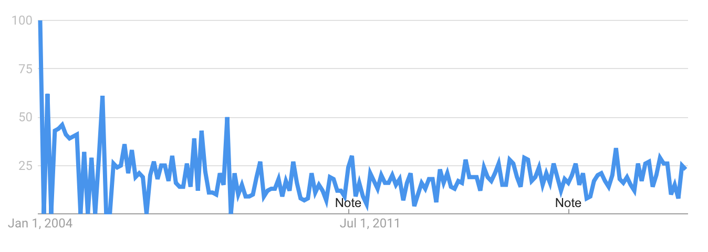
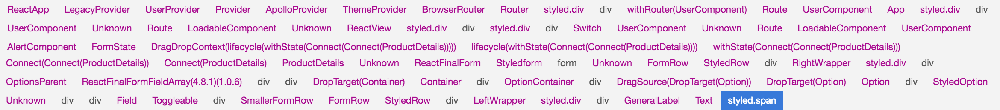

class: center, middle, inverse

# React is Not Composable!

Alternate title:

<h3>
    Components can be useful<br>
    but let's not get carried away.
</h3>

## ReactJS Utah 2018

by Seth House

@whiteinge<br>
seth@eseth.com

???

Misc.

 * Quick thoughts on state management:

   * React does not separate state management from rendering but sometimes they
     are separate concerns. Esp. in performance-critical paths.

---

class: inverse, center, middle

# React: A (Short) History.

---

## The 'V' in MVC.

([2013](https://github.com/facebook/react/commit/cfe3b75cb010653ea5dfcea74bc8a36911587504#diff-1a523bd9fa0dbf998008b37579210e12))

---

## Declarative Rendering

brought us out of the dark ages of imperative DOM juggling.

---

## Had to convince the industry of several new ideas.

--
* How on earth is this performant?
--

* JSX is both HTML and JavaScript, but it's just another view language.
  <br>(Templating i.e., Handlebars, Mustache, etc.)
--

* Why doesn't this violate separation of concerns?

???

* https://jlongster.com/Removing-User-Interface-Complexity,-or-Why-React-is-Awesome
* https://medium.com/@dan_abramov/youre-missing-the-point-of-react-a20e34a51e1a

---

class: middle



[Separation of Concerns 2004-2018](https://trends.google.com/trends/explore?date=all&geo=US&q=separation%20of%20concerns)

---

class: middle

.pull-left[
One traditional view is:

* HTML - Model
* CSS - View
* JavaScript - Controller
]

.pull-right[
But what's the difference with:

* JavaScript - Model
* JavaScript - View
* JavaScript - Controller
]

---

class: middle

> Separating HTML and JS is separating technologies.<br>
> It is not separation of concerns.
>
> – Rob Eisenberg (Aurelia)

???

* There's no difference (from a high level) between using JSX or JavaScript or
  Handlebars or Mustache or whatever as a templating or view language. Mapping
  over a collection in JSX produces the same thing as the
  `{{#foo}}<b>{{name}}</b>{{/foo}}` constructs in Mustache.
* I'm no fan of JSX, but React likely would have had a much harder time gaining
  adoption if the view language was plain JavaScript.
* Web applications are not documents. The parts that make up a UI are different
  than the parts that make up a document. Blog content should be able to be
  restyled without changing the content. An application will need to have style
  and content change together.

  But that doesn't mean that separation of concerns isn't important. Doing
  so allows better collaboration, better maintanance, and can allow for
  easier parallel development in teams. The language or markup between
  separations is just a syntactical detail. "Separating HTML and JS is
  separating technologies. It is not separation of concerns."

  They're still separated. But that does make it easier to lose sight of where
  the boundaries and separations are in your app.

  – https://hashnode.com/post/does-react-really-violate-separation-of-concern-by-putting-html-and-js-in-a-single-file-cil3bn5hj0011a65347rsdut0/answer/cil4sxqi500ifz35376gehp4e

---

## Continued mainstreaming functional ideas in JS.

```js
const app = view(state)
```

???

So many compile-to-JS ecosystems have built language-specific libraries and
frameworks on top of React. ClojureScript, PureScript, BuckleScript, etc.

---

class: middle

> React’s true strengths: composition, unidirectional data flow, freedom from
> DSLs, explicit mutation and static mental model.
>
> – [Dan Abramov (2015)](https://medium.com/@dan_abramov/youre-missing-the-point-of-react-a20e34a51e1a)

---

## But!

* Routing.
* Controllers.
* Data stores.
* Data fetching.
* Code organiztion.
* App organiztion.
* Development environment.

---

class: middle

Alt, Barracks, Delorean, disto, fluce, fluctuations, Flummox, Flux, Flux This,
Fluxette, Fluxible, Fluxxor, Fluxy, Lux, Marty.js, Material Flux, McFly,
microcosm, microflux, mmox, Nuclear.js, NuclearJS, OmniscientJS, Reducer,
Redux, Reflux.

(Flux variants circa 2015)

???

Redux got really popular really fast and sucked all the oxygen out of the room.
I get it. There were _dozens_ of competing Flux implementations. Redux has
a lot going for it: simple, well supported, great developer tooling. But it
never had a satisfactory answer to async (thunks and sagas suck,
redux-observable is constrained). And that's amazing because async is _all_ we
do. Composing reducers is not a thing.  It is verbose, reducers are too large,
and case statements suck. It left a bad taste in some people's mouths.

---

## Late 2015: The community starts to settle around a few projects.

---

class: middle

> So long, V in the MVC!
>
> – [Dan Abramov (2016)](https://twitter.com/dan_abramov/status/741462507861233665)

---

## The future?

* create-react-app.
* React Router.
* Redux.
* Context.
* Suspense.

---

class: center, middle

# Composition.

---

## Object-oriented composition.

* Mixins.
* Managing instances of other classes from within a class method.

Ad-hoc and manual.

???

The OOP world (as is typical there) doesn't define object composition as
a specific thing but rather a broad advice, maybe even design pattern.

---

## Functional composition.

```js
const compose = (f, g) => (...args) => f(g(...args))
```

The application of one function to the result from another function.

```js
SomeContainer
    .map(fnFoo)
    .map(fnBar)
    .map(fnBaz)
```

???

The functional programming and category theory worlds have very precise and
specific definitions for function composition as well as object composition
(for specific types of morphisms between objects).

---

## Informal composition.

"Using different things together."

---

## Is React OOP or functional?

OOP?
```js
class MyComponent extends React.Component {
    someMethod() {...}
    render() { return <div>...</div> }
}
```
--

Functional?
```js
const MyComponent = (props) => <div>...</div>
```

---

## What composition does React use?

---

## Higher-order components.

```js
function wrapInHOC(OldComponent) {
    const newComponent = (moreProps) => <div>
        <OldComponent {...moreProps}/>
    </div>
}

const EnhancedComponent = wrapInHOC(WrappedComponent);
```

> [A] higher-order component is a function that takes a component and returns
> a new component.
>
> – https://reactjs.org/docs/higher-order-components.html

---

## Higher-order components.

```js
function wrapInHOC(OldComponent) {
    const newComponent = (moreProps) => <div>
        <OldComponent {...moreProps}/>
    </div>
}

const EnhancedComponent = wrapInHOC(WrappedComponent);
```
--

```js
function wrapInFn(oldFunction) {
    return function newFunction(...oldArgs) {
        return oldFunction(newArgs, ...oldArgs)
    };
}
```
--

* Function decorator pattern?
--

* Perhaps currying? 

  `addBazProp(addBarProp(addFooProp(WrappedComponent)))`

---

## Higher-order components.

> Toss it in a closure.  
>
> Benefits:  
> - Easy to implement  
>
> Drawbacks:  
> - Everything has access to settings everywhere whether it needs it or not.  
> - Implicitly stateful  
> - Need data up front  
>
> – [Tail of three envs](https://gist.github.com/DrBoolean/917f9a34fd87716a455493c96a868633)

---

## Render props.

```jsx
class LogicComponent extends React.Component {
    ...stuff...
    render() {
        return this.props.someRenderFunction(this.state)
    }
}
```

> A component with a render prop takes a function that returns a React element
> and calls it instead of implementing its own render logic.
>
> – https://reactjs.org/docs/render-props.html

---

## Render props.

Benefits:
- Separate business logic or utility logic from rendering.
- Better testability.

Drawbacks:
- Data must be pre-processed (formatted, grouped, culled, etc).
- Must be fast and efficient.
- Render function has no control over when or how often it is called.
- Author of render function has no control over where it is placed.
- Subject to props tunneling.
- Exist solely to work around the drawbacks of classes.

---

## Render reducers (😱).

```jsx
<SomeComponent
    reducerFoo={someFunction)
    renderFoo={otherFunction} />
```
--

  

Benefits:
- Separate state management from rendering.
- Better testability.

Drawbacks:
- User of a reducer function must be very aware of the performance
  characteristics and intended usage of the function.
- Reducer function composition inside render function.
- No effects management (without reinventing Flux).
- Subject to props tunneling.
- Exist solely to work around the Drawbacks of classes.

---

class: inverse, middle, center

# Interlude.

---

class: middle, center

# Trees.

### (The composite pattern.)

???

* Trees are the most common way to construct a GUI. This is the composite
  pattern in the GoF book.

---

class: center, middle


???

Thanks to Oleg Burlaca for beautiful Graphviz graphics of a DOM tree:
http://www.burlaca.com/2009/02/html2gdl-graphviz/

---

## Message passing.

(And state management.)
--

* Parent-to-child: rebuild a subset of the tree.
--

* Child-to-parent: event bubbling <br>(chain of responsibility pattern).
--

* Sideload data external to the DOM tree <br>(flyweight pattern + pub/sub or
  observer patterns).

--

> The flyweight pattern shows how to rework a design without storing parents
> altogether. It works in cases where children can avoid sending parent
> requests by externalizing some or all of their state.
>
> – Gang of Four book pg. 167

---

## React component tree.

* Components are _not_ the DOM tree.
--

* But they can be used to construct one.
--

* Encapsulate logic or behavior.
--

* A tree can store state and arbitrary other things like behavior and logic.

---

class: middle



Component tree (81 components deep).

--


Corresponding DOM tree (21 elements deep).

---

exclude: true

## So where should state live?

.pull-left[
Inside component:
* 👍 Component is a black-box.
* 👍 Place anywhere in the tree.
* 👎 Communication with outside elements tied to tree structure.
* 👎 Sometimes pass communication through unconcerned elements.
]

.pull-right[
External to the tree:
* 👍 Communicate directly with any element.
* 👎 State and component must be wired together separately.
]

---

## A component-local-state scenario.

---

class: center, middle


???

* State lives in one component (open/closed or whatever), but now another
  component needs to know, so use props and callbacks to send messages. Awkward
  and the child needs to know way too much about what the parent wants. If we
  need to pass a message down several levels each child in each intermediary
  level needs to pass something through. (If we're using Flow, then it needs to
  know exactly what we're passing through.)
* Now another component elsewhere in the tree also needs to know so we refactor
  the component the houses the state and move the state upward. We've invented
  the controller component. Any component that was previously getting piecemeal
  state via the callback now has to pass the callback through a different props
  tunnel. Or maybe we refactor it to not use the callback since we can just
  make the state available now via closure.
* Say we want to store the currently logged in user. We need to make it
  available to a bunch of other components too but it's not related to the DOM
  hierarchy in any way. But we have to do it somewhere so we make an arbitrary
  decision. and tie state, which has nothing to do with the DOM hierarchy, to
  the DOM hierarchy.
* This gets hard to do at scale so we create intermediary controller components
  that blindly pass children through in order to make certain values available
  to them via closure. We've invented HoC.
* Constantly refactoring state up and down the DOM tree is pretty invasive work
  so we decide it would be nice to specify an arbitrary place in the DOM
  hierarchy for the state to live. So as soon as you need to raise state up the
  hierarchy you can say, "The state should live <here>. Er, I mean <here>. Er,
  no, how about <here>?" We've invented context.
* Over time we decide the controller component is collecting too much random
  stuff. None of it is related to each other, they just happen to be near each
  other in the DOM tree. So we make an inversion of control and have the parent
  pass a function that the child will blindly render so that the parent can
  directly control the child without the child having to know too much. We've
  invented render props.
* We can't differentiate state management from rendering so the render prop has
  to be pretty fast. And they can only do simple things.
* We need the contents of a render prop to be able to change something in
  a parant component. We don't want to prop tunnel and pass callbacks because
  that wasn't fun last time so this time we pass a reducer function that the
  child can call. We've invented render-reducers. We have to be careful to only
  call the reducer function in the kind of event it was intended for. (E.g.,
  onClick is much less frequent than, say, onScroll.)
* Now we need some data from an XHR call. We don't want to render the page
  without it and we don't want to put a bunch of conditionals all over. So we
  encapsulate all the possible states inside a container and render whichever
  state corresponds to the current value. We've (mostly) invented Suspense.
* Oof, except now two components are trying to use the same async data and we
  don't want to fetch it twice. They have no good way to communicate with each
  other because they can live in separate places in the DOM tree and shouldn't
  even have to know each other. So we need a generic data-fetching backplane
  that can perform automatic de-dupe and caching. We've invented a data layer.
* Hopefully at this point it's feeling like we're trying to do way too much
  inside the DOM hierarchy. So many of these things are either not related to
  the hierarchy or they're directly trying to work around it. We've tied
  non-hierarchical operations to a hierarchy.

---

## Context is not state management.

--

> Maybe you don’t care about the easy debugging, the customization, or the
> automatic performance improvements – all you want to do is pass data around
> easily.
>
> – https://daveceddia.com/context-api-vs-redux/ 

???

https://blog.isquaredsoftware.com/2018/03/redux-not-dead-yet/

---

## The jury is still out on Suspense.

* Convenient API.
* But we can do some (all?) of Suspense with better async primitives.

  * http://talks.eseth.com#js-adts

???

[Demo](https://gist.github.com/whiteinge/7721a637afd4c001313514062bd1bdbb#gistcomment-2609033)

---

class: inverse, center, middle

# End of interlude.

---

class: center, middle

# (Back to) Components.

---

## Props are...

--

* Component attributes (configuration).

--

* Message passing (parent-to-child via changing props).

--

* Message passing (child-to-parent via passing a function the child must call).

--

* Function arguments (data).

--

* Component styles.

--

* Child-component styles.

--

* Other components (HoC).

--

* Sub-render functions.

--

* State management functions.

--

* Tunneled through wrapper components to distant children.

--


...not composable.

---

## Components...

--

* Are often stateful classes.
--

* Have a very stateful API:

  * Impure `render()`.
  * Missing current value in `setState()` callback.

--

* Require lifecycle methods for
  [day-to-day performance tuning](https://www.youtube.com/watch?v=LkSWyqNUBq8).

--

* Highly coupled to where they live in the component tree.
--

* Encapsulate state, business logic, data fetching, effects, and view.

--

  * All of which do compose!
  * But they compose completely differently.

--

...are not composable.


---

class: center, middle

# Closing thoughts.

---

## We're still figuring out how to make UIs!

--

* The software industry is crazy young.

--

* How many times are we going to rewrite our apps over and over for each new framework?

--

* How many times are we going to write confusing, unmaintainable behemoths?

--

* We need people who care to keep discussing patterns.

--

* Focus on programming fundamentals and techniques.

--

* Read books.

--

* Really _learn_ JavaScript.

--

* Be wary of the new framework du jour.

---

class: middle

> I think developers have been sold this idea of a competitive landscape by
> authors of these frameworks because it helps sell the framework. You can
> build and strengthen a community by leaning into the tribalism that can
> surround the usage of a tool.
>
> The older I've gotten as a person who was deeply tribalistic about Ruby on
> Rails when I got into it and Ember when I got into it, because I love tribes,
> I think tribes are awesome and it's a way to make friends but when you really
> lean into that, the costs are too high and experimenting with other
> technologies and noticing flaws in your own technology is not only not
> a betrayal, it's actually critical to your growth as a developer.
>
> – The Frontside Podcast https://frontsidethepodcast.simplecast.fm/25857c8d

---

## People are interested in exploring composition!

The compile-to-JS functional communities are a wealth of ideas.

---

class: center, middle


[Brian Lonsdorf - Oh Composable World! (React Rally 2016)](https://youtu.be/SfWR3dKnFIo)

---

class: center, middle

### We need composable, async-first<br>state management ideas.

???

* Microstates: https://frontsidethepodcast.simplecast.fm/76943ff3
  Stop rebuilding state management for every single framework!

---

class: center, middle

### We need good message passing primitives.

???

* Up and down the DOM tree.
* Differentiate all the disparate things that props are used for.

---

## Evaluating a new framework or library.

* Does the library espouse a new idea or technique?

--

* What are the author's motivations?

--

* Do they use React in their day-job?

--

* Watch out for hero-worship (especially from the Big Tech Companies).

--

* Watch out for bike-shedding and personal preference. Stick to demonstrable
  improvements in _maintainability_ over time.

???

* Be wary of people pushing frameworks to get their name out there or win
  internet points or sell training. Focus on the people that are building real
  apps for their day-job. Academic research requires engineering
  experimentation to work; but make sure you know when you're participating in
  an experiment or not. Deconstruct what the core techniques. Is this just
  another variation on the flavor chocolate (Yet Another MVC?) or is it bring
  new ideas to the table?

* The people at the Big Tech companies are not wizards from on-high. They're
  just folk and make mistakes and advocate for bad patterns along with the rest
  of us working stuffs. (Seealso: the complete and utter abandonment of Angular
  1 and the Object.observe() standards-track proposal.)

* An example of bikeshedding is: I dislike JSX. Not magic. Not HTML. Not
  JavaScript. Yet Another Templating Language. It is confused about who it's
  audience is. An HTML audience will be confused with the non-HTML semantics
  and haivng to sling JavaScript. A JavaScript audience will get tangled up
  diving into and out of which parts are JSX/HTML/JavaScript `<MyComponent
  foo="Foo" bar={bar} {...{baz: 'Baz', qux, quux}} />` But that's not a debate
  with any technical merit, just personal preference.

---

class: middle

> Software Engineering is still an aspiration...  
> ...because Computer Science is not yet a science.
>
> – Ruth Ravenel, U of Co 1995

---

## Not everything should be a component.

* A component is indirection! Only use as many as you need.

--

* Write regular JavaScript where you can.

--

* Useful but in moderation.
