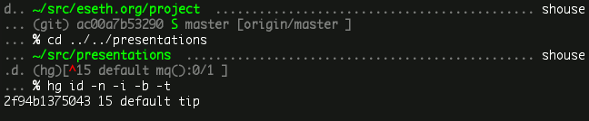

class: center, middle, inverse

<h1 style="color: #777872">
    Zsh
    <br>
    <span style="font-size: 60%;">
    Features Tour
    </span>
</h1>

A brownbag workshop at


by Seth House

@whiteinge<br>
seth@eseth.com

---

## History

- Written in 1990 by Paul Falstad at Princeton University.
- Named for the login of a teaching assistant, Zhong Shao.
- Implements many of the features of bash, ksh, and csh  
  (tries to emulate *sh* or *ksh* when invoked as `sh` or `ksh`).

---

## Niche

IMO, Zsh is a good fit if you:

- Want Granular control & customization over the *UI/UX* of your shell.
- Want a large standard-library of functionality.
- Want a POSIX subset (and are ok with a superset).
- Don't mind fiddling.


--


Others

- Dash/Ash/mksh/Busybox:
  - Strict POSIX compatibility.
  - Minimal feature-set.
- Bash:
  - Often the default interactive shell.
  - Medium feature-set.
  - POSIX subset (and Bash superset).
  - Don't mind fiddling.
- Fish:
  - (Mostly) out-of-box pre-configured.
  - Large feature-set.
  - Want to avoid POSIX.

---

### A note about Oh My Zsh

--

- Possibly a more out-of-box Zsh experience.
- _Very_ popular.
- Complex.
- ~325 Plugins of varying quality  
  maybe useful, maybe NIH.


--

A comparison?

- Bash & Readline — 182k SLOC (C, Bash)
- Fish — 130k SLOC (C++, Rust, Fish)
- Zsh — 114k SLOC (C & Zsh)
--

- Oh My Zsh — 23k SLOC (Zsh, Bash, Python)  

---

## Heavily documented

```sh
% man 1 zshall | wc -w
209447

% man -k . | grep '^zsh'
zsh (1)              - the Z shell
zshbuiltins (1)      - zsh built-in commands
zshcalsys (1)        - zsh calendar system
zshcompctl (1)       - zsh programmable completion
zshcompsys (1)       - zsh completion system
zshcompwid (1)       - zsh completion widgets
zshcontrib (1)       - user contributions to zsh
zshexpn (1)          - zsh expansion and substitution
zshmisc (1)          - everything and then some
zshmodules (1)       - zsh loadable modules
zshoptions (1)       - zsh options
zshparam (1)         - zsh parameters
zshroadmap (1)       - informal introduction to the zsh manual
zshtcpsys (1)        - zsh tcp system
zshzftpsys (1)       - zftp function front-end
zshzle (1)           - zsh command line editor
```

---

## Modules

--

```sh
man 1 zshmodules
man 1 zshcontrib
```

---

### Module: Interactive setup

```sh
autoload -Uz zsh-newuser-install
zsh-newuser-install -f
```

---

### Module: Colors

```sh
autoload -U colors && colors
echo \
    ${fg[yellow]}Hello${reset_color}, \
    ${fg[red]}world${reset_color}.

# ...or wrap colors in %{ and %} in prompts:

PS1='%{$fg[green]%}%~%{${reset_color}%} %# '
```

---

### Module: Themeable prompts

```sh
autoload -U promptinit && promptinit
prompt -p
```

---

### Module: Tetris

```sh
autoload -U tetriscurses
tetriscurses
```

---

### Module: Completions

(Can also use bash completion definitions.)

```sh
autoload -U compinit && compinit -C

curl -<tab>
curl <tab>
kill -<tab>
kill <tab>
```

--

Associate existing completion for an alias:

```sh
compdef c=curl
compdef ll=ls
compdef la=ls
```

---

### Module: Completions (custom)

```sh
zstyle -e ':completion:*:(ssh|scp|sshfs):*' hosts 'reply=(
    ${=${${(M)${(f)"$(
        cat ~/.ssh/config ~/.ssh/*.conf
    )"}:#Host*}#Host }:#*\**}
)'
```

--

(Brutal syntax for newcomers, but well-documented and highly consistent.)

--

1.  Read SSH config files: `$(cat ~/.ssh/config ~/.ssh/*.conf)`
2.  Split string into array by newlines: `${(f)foo}`
3.  Remove non-matching array values: `${(M)foo:#Host*}`
4.  Remove matching string prefix from each array value: `${foo#Host }`
5.  Remove wildcard (`*`) SSH hosts: `${foo:#*\**}`
6.  Join array back into string using word splitting rules: `${=foo}`.


---

### Module: Completions (behavior)

```sh
# :completion:function:completer:command:argument:tag
zstyle ':completion:*:*:ls:*' menu yes select
zstyle ':completion:*:*:ls:*' file-sort time
zstyle ':completion:*:*:ls:*' file-sort name
zstyle ':completion:*:*:ls:*' file-sort size
zstyle ':completion:*'        format 'Completing %d'
```

---

### Module: zparseopts

Short, long, mandatory, optional, multiple occurances, defaults, allow unknown
flags.

```sh
autoload -U compinit
set -- -a -b -c --long
zparseopts a=array_foo b=array_bar c=array_baz -long=array_long
echo ${array_foo}
# -a
echo ${array_long}
# --long
```

---

### Module: zmv

```sh
autoload -U zmv
zmv '(*)-(*).mpeg3' '$2_$1.mp3'
```

---

### Module: vcs\_info

```sh
autoload -Uz vcs_info
zstyle ':vcs_info:*' enable bzr cdv cvs darcs \
    fossil git tla hg mtn p4 svn svk

vcs_info
echo ${vcs_info_msg_0_}
```

---

## Shell options

```sh
man 1 zshoptions
```


--

- `auto_cd` — Change dirs without `cd`
- `auto_pushd` — Automatically retain the directory stack.
- `chase_links` — cd to the target of a symlink
- `correct` — Run spelling correct on typed commands
- `extended_history` — Store timestamps in shell history
- `hist_ignore_all_dups` — Expire duplicate commands in history
- `hist_ignore_dups` — Avoid multiple history entries for repeat runs
- `hist_ignore_space` — Don't add command to history if begins with space
- `hist_reduce_blanks` — Trim command before saving to history
- `hist_save_no_dups` — Remove duplicate commands when saving history file
- `hist_verify` — Edit command from history before re-executing
- `ignore_eof` — Don't exit shell on ctrl-d
- `list_types` — Show file type markers when completing files
- `noclobber` — Don't accidentally overwrite files with `>`
- `noflowcontrol` — Disable ctrl-s/ctrl-q in ZLE
- `prompt_percent` — Enable expansion of many prompt escapes
- `prompt_subst` — Allow command substitution in prompts
- `rm_star_wait` — Confirm before running `rm path/*`
- `share_history` — Read/write commands from history file immediately

---

## Shell parameters

- `CDPATH` — Set search path for the `cd` command
- `REPORTTIME` — Automatically output timing info for long commands
- `WATCH` — Automatically report log-ins/outs on the system

---

## Prompts

- `PS1`
- `RPROMPT`
- Excellent multi-line prompt support


--



---

## Alias suffixes

Define default handlers for file types.

```sh
alias -s php=code
alias -s sh=vim
touch foo.php bar.sh
foo.php
bar.sh
```

---

## Global aliases

Define aliases that can appear anywhere in a command.

```sh
alias -g IN='..@{u}'
alias -g OUT='@{u}..'
alias -g UP='@{u}'

# Choose the last item in the filename glob.
alias -g LAST='*([-1])'

# Selects a random file: `mpv RANDOM`
alias -g RANDOM='"$(shuf -e -n1 *)"'

# Output stderr in red. Usage: somecomand RED
alias -g RED='2> >(while read line
    do echo -e "\e[01;31m$line\e[0m" >&2; done)'
```

---

## Glob Qualifiers

`zshexpn(1)` manpage under "Glob Qualifiers"

```sh
touch foo
mkdir bar
ln -s bar baz
ln -s qux quux
mkfifo quuz
touch corge-{1..10}
touch grault
chmod +x grault
dd if=/dev/zero of=garply bs=11000 count=1
touch waldo
chmod u-w waldo
```

---

### Globs: File types

```sh
ls *(.) # regular Files
ls *(^.) # irregular Files
ls *(/) # directories
ls *(*) # executable files
ls *(@) # symlinks
ls *(-) # follow symlinks
```

Note:

```sh
ls **/ # recursive search
```

---

### Globs: File sizes and permissions

```sh
ls *-<1-5> # files matching a range
ls *(mm-1) # files modified less than 1 minute ago
ls *(Lk+10) # files greater than 10 KB
ls *(r) # readable by you
ls *(w) # writable by you
ls *(U) # owned by you
```

---

### Globs: Combinations

Combinations:

```sh
ls *(-@) # broken symlinks
ls *(r^w) # readable but not writable for you
ls *(^u:root:) # files not owned by root
```

---

### Disable globbing

```sh
% curl https://example.com?foo=Foo
% noglob curl https://example.com?foo=Foo
alias c='noglob curl'
```

---

## Hooks

`zshmisc(1)` manpage under "SPECIAL FUNCTIONS"

- `chpwd` — When the current directory changes
- `periodic` — On an interval, before prompt is drawn
- `precmd` — Before each prompt
- `preexec` — After command is entered, before command is executed
- `zshaddhistory` — After history is recalled, before command is executed
- `zshexit` — When shell exits

---

## Arrays

- `zshexpn(1)` manpage under "PARAMETER EXPANSION"
- `zshparam(1)` manpage under "ARRAY PARAMETERS"
- Numerical arrays or associative arrays (very PHP-like)
- sort, join, split, map, filter, iterate over keys or values, or keys and
  values, index, slice, (some) set operations.

```sh
extra_path=(
    $HOME/bin \
    $HOME/.nodejs/nodejs/bin \
    $HOME/.cabal/bin \
    $HOME/.cargo/bin \
    $HOME/.local/bin \
    $HOME/.luarocks/bin/ \
    /sbin \
    /usr/sbin \
    /usr/local/bin \
    /usr/local/sbin \
)
export PATH="${(j|:|)extra_path}:$PATH"
```

---

## vi-mode

```sh
bindkey -v

bindkey "^?" backward-delete-char
bindkey -M viins '^p' history-beginning-search-backward
bindkey -M vicmd '^p' history-beginning-search-backward
bindkey -M viins '^n' history-beginning-search-forward
bindkey -M vicmd '^n' history-beginning-search-forward

# Edit command with an external editor
zle -N edit-command-line
bindkey -M vicmd "v" edit-command-line
```

(The `zle-keymap-select` function is called when the mode changes.)

---

## Widgets

In the `zshcompwid(1)` manpage.

```sh
foo-thing() {
    zle -M "I'm doing a thing..."
    zle -R
    sleep 2 # the thing

    LBUFFER="${LBUFFER} with an addition."

    zle reset-prompt
    zle -R
}

zle -N foo-thing
bindkey '^F' foo-thing
```

---

## A robust, minimal `~/.zshrc`

```sh
autoload -U compinit && compinit -C
autoload -U colors && colors
autoload -Uz vcs_info
precmd_functions=( vcs_info )

setopt hist_save_no_dups list_types \
    prompt_percent prompt_subst share_history

zstyle ':completion:*' list-colors "$LS_COLORS"
zstyle ':vcs_info:*' enable git

# Cur dir, background jobs?, prev command fail?, prompt.
promptseg=( \
    '%{$fg[green]%}%~%{${reset_color}%} ' \
    '%(1j.%j .)' \
    '%(0?.%{$fg[white]%}.%{$fg[red]%})' \
    '%#%{${reset_color}%} ' \
)
PS1=${(j::)promptseg}
RPROMPT='${vcs_info_msg_0_}'

alias ls='ls --color=auto -F'
alias ll='ls -l'
alias la='ls -a'
```

---

## Slightly less minimal

```sh
autoload -U promptinit && promptinit
prompt adam2 grey green cyan white

zstyle ':vcs_info:git*' check-for-changes true
zstyle ':vcs_info:git*' check-for-staged-changes true
zstyle ':vcs_info:git*' get-revision true
zstyle ':vcs_info:git*' formats '(%s) %12.12i %c%u %b %m'
zstyle ':vcs_info:git*' actionformats '(%s|%a) %12.12i %c%u %b %m'
zstyle ':vcs_info:git*+set-message:*' hooks git-st
function +vi-git-st() {
    local ahead_and_behind=(
        ${=${(M)${(f)"$(
            git --no-optional-locks status --porcelain=v2 --branch
        )"}:#\# branch.ab*}#\# branch.ab }
    )
    hook_com[misc]+=${(j:/:)ahead_and_behind}
}
```
