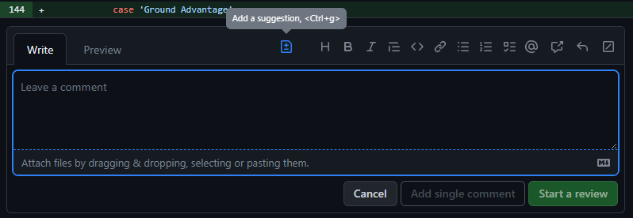

class: center, middle, inverse

<h1 style="color: #777872">
    git commit --fixup
</h1>

A brownbag workshop at


by Seth House

@whiteinge<br>
seth@eseth.com

---

## The Golden Rule of Git Rebase

--

Don't rebase shared branches.

--

...a PR under review counts as shared.

---

## Problem?

--


--

.smaller[
```
% git fetch
Fetching origin
remote: Enumerating objects: 56, done.
remote: Counting objects: 100% (56/56), done.
remote: Compressing objects: 100% (19/19), done.
remote: Total 34 (delta 25), reused 23 (delta 14), pack-reused 0
Unpacking objects: 100% (34/34), 12.73 KiB | 3.18 MiB/s, done.
From github.com:some-org/some-repo
   a0fa5d45..6a419b3f  cockatoo     -> origin/cockatoo
 * [new branch]        talks        -> origin/talks
 + 1dc7050b..3e399553  nunneries    -> origin/nunneries  (forced update)
   1f4cd98c..d6cf5f39  disoriented  -> origin/disoriented
 * [new tag]           v5.0         -> v5.0
 * [new tag]           v9.0         -> v9.0
```
]

---

## Solution?

- Don't rebase while a PR is being reviewed.
- Add new commits instead.
- Rebase after approval.
--

- Git already supports this workflow with "fixup" commits.

---

## Rebase use-cases

--

```
# Move your commits on top of other commits (like `master`):
      A---B---C topic
     /
D---E---F---G master

              A'--B'--C' topic
             /
D---E---F---G master
```
--

```
# Reorganize your own commits:
      A---B---C---D topic
     /
D---E---F---G master

      AC'---BD' topic
     /
D---E---F---G master
```
--

...or both.

---

## Interactive rebase refresher

--

.smaller[
```
# Rebase 39da67d..1c71051 onto 39da67d (2 commands)
#
# Commands:
# p, pick <commit> = use commit
# r, reword <commit> = use commit, but edit the commit message
# e, edit <commit> = use commit, but stop for amending
# s, squash <commit> = use commit, but meld into previous commit
# f, fixup [-C | -c] <commit> = like "squash" but keep only the previous
#                    commit's log message, unless -C is used, in which case
#                    keep only this commit's message; -c is same as -C but
#                    opens the editor
# x, exec <command> = run command (the rest of the line) using shell
# b, break = stop here (continue rebase later with 'git rebase --continue')
# d, drop <commit> = remove commit
# l, label <label> = label current HEAD with a name
# t, reset <label> = reset HEAD to a label
# m, merge [-C <commit> | -c <commit>] <label> [# <oneline>]
# .       create a merge commit using the original merge commit's
# .       message (or the oneline, if no original merge commit was
# .       specified); use -c <commit> to reword the commit message
#
# These lines can be re-ordered; they are executed from top to bottom.
#
# If you remove a line here THAT COMMIT WILL BE LOST.
#
# However, if you remove everything, the rebase will be aborted.
```
]

---

## `git commit --fixup`

Find the commit message:

- Manually: `git --fixup=<sha>`

--

- Use history-search ref syntax `git --fixup=:/Add foo widget`

--

- Use a fuzzy-finder:
  ```
  git log --oneline @{u}.. | fzf | cut -d' ' -f1 \
      | xargs -I{} git --fixup={}
  ```

--

- [VS Code addition (open
  PR)](https://github.com/gitkraken/vscode-gitlens/pull/1770)

---

## Send a "fixup" commit to someone

--

  - Similar to a "suggestion" comment in GitHub PRs.
    

--

  - Push a `fixup!` commit directly another branch.

--

  - Email a `fixup!` patch file (applied with `git am`).

---

## `git rebase -i --autosquash`

--

Automatically reorder commits:

```ini
pick becb6d4 Add-B
fixup 3f2cd38 fixup! Add-B
pick 6a7c1ef Add-C
fixup 8974cd7 fixup! Add-C
pick c394de8 Add-D

# Rebase 2074d52..8974cd7 onto 2074d52 (5 commands)
# [...]
```

---

## Rebase against `master` or merge-base?

--

.smaller[
```
      A---B---C topic
     /
D---E---F---G master

              A'--B'--C' topic
             /
D---E---F---G master

---

      A---B---C---D topic
     /
D---E---F---G master

      AC'---BD' topic
     /
D---E---F---G master
```
]

---

## Aside: undoing a commit with reset

`git reset HEAD~1`

- Keeps the same merge-base.
- Allows you to recreate the commit from scratch.
- Useful! (And avoids Git machinery.)

--
- But if the commit is good:
  - Add to the commit:  
    `git commit --amend`
  - Reword the commit message:  
    `git commit --amend -o`
  - Move the commit elsewhere:  
    `git cherry-pick <SHA>`
  - Move multiple commits to separate branches:
    ```sh
    git branch -c <new branch 1>
    git branch -c <new branch 2>
    git branch -c <new branch 3>
    git checkout <new branch 1>
    git rebase -i
    # ...repeat for the other branches
    ```
- (Stay after to talk details.)

---

## Rebase flowchart

- Has the PR already been reviewed?
  - **No**
    - Are there merge conflicts with `master`?
      - **No**
          - An out-of-date branch is not a problem if there are no conflicts.
          - Rebase against merge-base or against `master` are both fine.
      - **Yes**
          - Rebase against `master` & resolve conflicts.
  - **Yes**
      - Are there merge conflicts with `master`?
        - **No**
            - Rebase fixup commits against merge-base after approval.
        - **Yes**
            - Has the PR been approved?
              - **No**
                  - Discuss with your reviewer.
              - **Yes**
                  1. Rebase fixup commits against merge-base.
                  2. Merge `master` into your branch and resolve the conflicts.
                  3. The conflict resolution will require re-approval:  
                     `git show -m -p`

---

## Check if rebase was successful

The changes (diff) from before and after the rebase should be _identical_.

--

Before you push:
```
git diff <last SHA before rebase>..<last SHA after rebase>
```

--

After you push:


