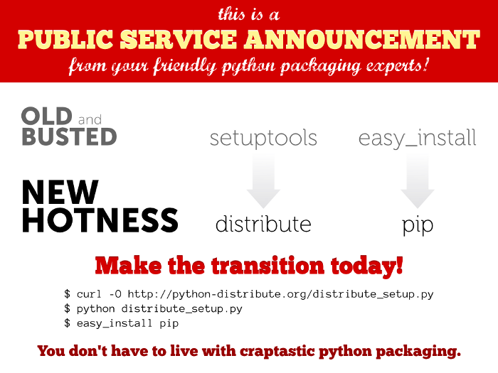

======================
Utah Python User Group
======================

:Author: Seth House <seth@eseth.com>
:Date: 2010-02-11

----------------------
Packaging & Deployment
----------------------

---------
Packaging
---------

.. r2b_note::

    tensions between Linux packaging and Python packaging

`Distutils`_
------------

    “Distutils is the standard mechanism to distribute Python packages and
    extensions since Python 1.6.”

    — PythonInfo Wiki

`Distribute`_
-------------

* Distribute is a fork of the Setuptools project.

----------
Deployment
----------

    “Deployment is one of the things I like least about development, and yet
    without deployment the development doesn’t really matter.”

    — Ian Bicking

`pip`_
------

`virtualenv`_
-------------

`Fabric`_
---------

`buildout`_
-----------

`toppcloud`_
------------

http://blog.ianbicking.org/2010/01/29/new-way-to-deploy-web-apps/

.. _`Distutils`: 
.. _`Distribute`: http://packages.python.org/distribute/
.. _`pip`: http://pip.openplans.org/
.. _`virtualenv`: http://virtualenv.openplans.org/
.. _`Fabric`: http://fabfile.org/
.. _`buildout`: http://buildout.org/
.. _`toppcloud`: http://toppcloud.colorstudy.com/
