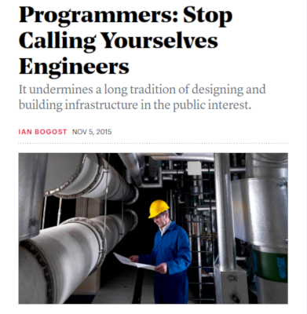
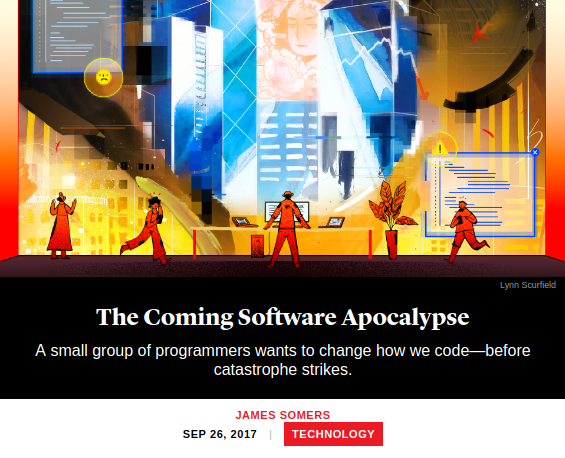
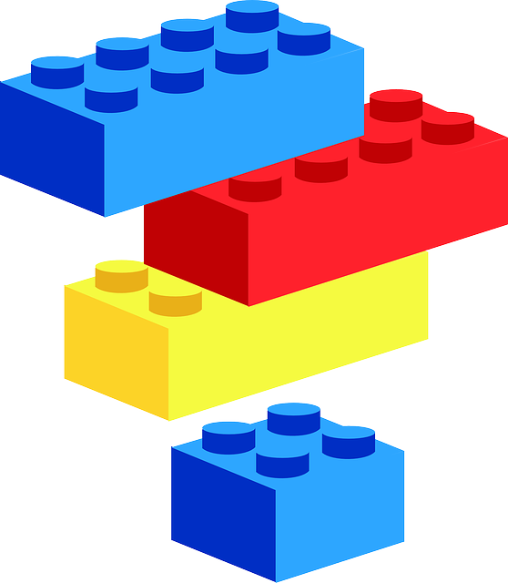
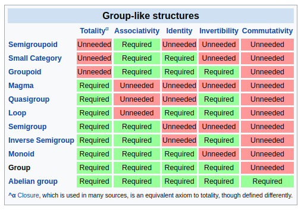

name: section
layout: true
class: center, middle, inverse

---

template: section

<h1 style="color: #777872">
Algebraic Data Types
<br>
Composition
<br>
<span style="font-size: 50%">and</span>
<br>
Software Complexity
</h1>

## Utah Clojure 2019-05-22

by Seth House

@whiteinge<br>
seth@eseth.com

---

class: center, middle
layout: false

Why JavaScript Programmers Should Learn Algebraic Data Types

http://talks.eseth.com/#js-adts

---

### Why JavaScript?

--

* "JavaScript fatigue".
--

* Inadequate primitives.
--

* Frameworks over fundamentals.

???

* "JavaScript fatigue" stems from an overwhelming deluge of new things to
  learn. But how many of those "new" things are minor syntactical variations on
  old things? Callbacks vs promises vs async/await. React lifecycle methods vs
  hooks. Every MVC framework ever.
* Inadequate primitives make common, basic needs too hard: state management,
  data flow, juggling async, managing side effects, writing things in a way
  that can be easily tested, and code layout and organization.
* The JavaScript world in particular seems to lean on libraries and frameworks
  not just for convenience but to solve the hard problems on our behalf. Better
  language primitives and education focused less on the framework du-jour and
  more on programming fundamentals would benefit us.

---

## Two equivalent approaches?

--

* Dynamic vs. static.
* Type-checking vs. (more) tests.
* Compile-time checks vs. run-time checks.

---

## Discussion!

--

* What are we trying to protect against, and how?
* Refactoring. (From both you and your teammates.)
* Renaming and code churn. (Is it worth it ever?)
* Feature additions and changing business requirements.
* Safety from bad external data.
* Safety from security breaches.
* Optimistic vs. defensive programming. (Boundaries?)
* Can you carefully prevent failures? Or do you plan for failures and have
  robust recovery (e.g. Erlang's OTP)?
* The goal is to have confidence that the thing you wrote is going to do the
  thing you say it's going to do, and that it will be resilient in the face of
  unknown or surprising usage.
* Composition for the UI like composition at the CLI?

---

class: center, middle
layout: false

## Software Complexity

---

class: center, middle

<a href="https://www.theatlantic.com/technology/archive/2015/11/programmers-should-not-call-themselves-engineers/414271/">
    
</a>

???

Interesting and compelling rebuttal:

Real Software Engineering, Glenn Vandenburg
https://www.youtube.com/watch?v=RhdlBHHimeM

Engineering disciplines

```
Defined           Empirical
<---|-|-|-|-|-|-|-|------->
    | | | | | | | `-- Software
    | | | | | | `-- Industrial
    | | | | | `-- Electrical
    | | | | `-- Chemical
    | | | `-- Aerospace
    | | `-- Mechanical
    | `-- Structural
    `-- Civil
```

---

class: center, middle

<a href="https://www.theatlantic.com/technology/archive/2017/09/saving-the-world-from-code/540393/">
    
</a>

---

class: center, middle

> The stakes keep rising, but programmers aren’t stepping up—they haven’t
> developed the chops required to handle increasingly complex problems. “In the
> 15th century,” he said, “people used to build cathedrals without knowing
> calculus, and nowadays I don’t think you’d allow anyone to build a cathedral
> without knowing calculus.

???

* Boeing Max 737.
* Self-driving cars.
* Equifax breach.

---

class: center, middle

> I look at the past century and I can't find one industry that improved safety
> or security without being forced. Cars, planes, pharmaceuticals, medical
> devices, food, restaurants, workplace, consumer goods, most recently
> financial products.
>
> In every case the economics rewards skimping on security and safety. Taking
> the chance, hoping you do ok, rolling the dice in the courts if you don't,
> and stalling regulation as far as possible.
>
> – Bruce Schneier

---

### Abstraction

Reduce boilerplate
<br>vs.<br>
Think on another level

---

class: center, middle

> It really does constrain your ability to think when you’re thinking in terms
> of a programming language. Code makes you miss the forest for the
> trees: It draws your attention to the working of individual pieces, rather
> than to the bigger picture of how your program fits together, or what it’s
> supposed to do—and whether it actually does what you think.
>
> – Leslie Lamport

---

class: center, middle
layout: false

## Composition.

???

It must be important, right? People talk about it all the time.

---

name: common-advice

### Common advice for functional-style coding.

* Write small, single-purpose functions.
--

* Make them pure.
--

* Compose them together into a larger whole.

---

class: center, middle

```js
const tableContents = _.chain(allRecords)
      .filter(_.overEvery(_.values(predicateFns)))
      .slice(curPageStart, curPageOffset)
      .orderBy(..._.unzip(orderedColumns))
      .map(x => _.pick(x, visibleColumns))
      .groupBy(currentSelection)
      .value()
```

---

class: center, middle

```js
const valOrDefault = ifThenElse(
    mq => mq.selected == null && 'defaultall' in $attrs,
    () => true,
    get('selected'));

const valShouldBeSelected = ifThenElse(
    () => selectionOverrides != null,
    mq => selectionOverrides.includes(mq.name),
    valOrDefault);

const markAsSelected = ifThenElse(
    valShouldBeSelected,
    mq => Object.assign({}, mq, {selected: true}),
    mq => Object.assign({}, mq, {selected: false}));

const getOptions = pipe([
    sortBy('name'),
    map(markAsSelected),
    map(createOption),
]);
```

---

class: center, middle
layout: false

### ...now what?

???

Composing functions into a larger whole is very useful, immediately so, and
that is important -- it would be a nightmare to code something like this in a
procedural style. But what's the next step? Programs are much more than a
collection of pure utility functions.

---

class: center, middle

> Favor composition over inheritance
>
> – Gang of Four

---

class: center, middle

> Designing is fundamentally about taking things apart in such a way that they
> can be put back together. Separating things into things that can be composed.
>
> – Rich Hickey

---

class: center, middle

> [Programming is] all about decomposing the problem and then recomposing
> solutions.
> <p>&nbsp;</p>
> <p>&nbsp;</p>
>
> – Bartoz Milewski

---

class: center, middle

> [Programming is] all about decomposing the problem and then recomposing
> solutions.
>
> There are so many ways of composing things and each of them is different.
> <p>&nbsp;</p>
>
> – Bartoz Milewski

---

class: center, middle

> [Programming is] all about decomposing the problem and then recomposing
> solutions.
>
> There are so many ways of composing things and each of them is different.
>
> Category theory describes all these various ways of composing things.
>
> – Bartoz Milewski

---

class: center, middle
layout: false

## Algebraic Data Types

---

class: middle

> Make everything a value.  
> Make your data a value.  
> Make your functions a value.  
> Make your effects a value.  
> Make your errors a value.  
> 
> – Paul Snively  #lambdaconf

<br>

---

class: middle

> Make everything a value.  
> Make your data a value.  
> Make your functions a value.  
> Make your effects a value.  
> Make your errors a value.  
> 
> – Paul Snively  #lambdaconf

This allows you to retain control of the execution of your program.

---

class: center, middle

### “The perfect API”.

<p>&nbsp;</p>

---

class: center, middle

### “The perfect API”.

(Brought to you by math.)

???

> Imagine for a second that everything had the same interface. Everything.
>
> – James Forbes https://james-forbes.com/?/posts/the-perfect-api

Using math for better problem solving
https://fixate.it/podcast/using-math-for-better-problem-solving-brian-lonsdorf/

Algebraic Domain Modelling
https://corecursive.com/005-algebraic-domain-modelling-using-functions-with-debashish-ghosh

---

class: center, middle



???

https://pixabay.com/en/blocks-building-brick-plastic-toy-32027/

> Composability measures the extent to which values can be combined with other
> values to produce like values.
>
> – John De Goes https://www.slideshare.net/jdegoes/orthogonal-functional-architecture

> Wouldn't it be wonderful if you could assemble software from predefined
> building blocks? This idea is old, and has been the driving force behind
> object-oriented programming (OOP).
> [...]
> Decades later, it doesn't look like we're much nearer that goal than before,
> but I believe that we'd made at least two (rectifiable) mistakes along the
> way:
> Granularity
> Object-orientation
> [...]
> The vision was always that software 'components' would be able to 'click'
> together, just like Lego bricks.
> While we (me included) have been on an a thirty-odd year long detour around
> object-orientation, I don't think all is lost. I still believe that a
> Lego-brick-like system exists for software development, but I think that it's
> a system that we have to discover instead of invent.
> Another, more crucial, difference to object-oriented programming is that
> these objects are lawful. An object is only a monoid if it obeys the monoid
> laws. An object is only a functor if it obeys the functor laws.
> Such objects are still fine-grained building blocks, but they fit into a
> system. You don't have to learn tens of thousands of specific objects in
> order to get to know a framework. You need to understand the system.
>
> – Mark Seemann http://blog.ploeh.dk/2018/03/05/some-design-patterns-as-universal-abstractions/

---

class: center, middle

<a href="https://en.wikipedia.org/wiki/Group_(mathematics)#Generalizations">
    
</a>

???

* [Reid Evans - Abstract Algebras and Where to Find Them Magmas, Monoids, and
  More!](https://www.youtube.com/watch?v=4IPXSj5NVxQ)

---

### Too hard?

--

> People say why do you need this thing? I can't prove that you need it. I
> would say try it without it and see how much work you have to do. See how
> much discipline you have to have. See how much structure you have to invent.
> And then maybe you'll come to appreciate what philosophies these systems
> embody.
>
> – David Nolen (on Om.Next / Falcor / et al)

???

You CAN use things that are built with these concepts without knowing these
concepts. And that's OK!

See the RxJS project and also Evan Czaplicki - Let's be mainstream!
https://www.youtube.com/watch?v=oYk8CKH7OhE

The jargon is not important to _use_ the thing and should never be a barrier to
entry. However the terms shouldn’t be hidden and become important once you
start wanting to build or extend the thing.

> if you introduce the solution (in this case, a new kind of math) before
> introducing the kind of problems that it’s meant to solve, the solution is
> likely to come across as pointless and arbitrary.
>
> [...]
>
> The thing is, monads aren’t actually all that complicated. In fact, most of
> the experienced functional programmers I’ve met consider them downright
> simple. It’s just that newcomers often have a really hard time trying to
> figure out what exactly monads even are.
>
> [...]
>
> Monads are a solution to a specific problem: the problem of repetitive code.
> If you write enough code in a functional programming language, you start to
> notice that you’re writing a lot of suspiciously similar code to solve a
> bunch of superficially different problems. Wouldn’t it be nice if you could
> just write this code once and then reuse it, instead of rewriting it slightly
> differently every time?
>
> – Max Kreminski https://mkremins.github.io/blog/doors-headaches-intellectual-need/

---

### Too hard?

> I find that when someone's taking time to do something right in the present,
> they're a perfectionist with no ability to prioritize, whereas when someone
> took time to do something right in the past, they're a master artisan of
> great foresight.
>
> – https://xkcd.com/974/

---

## Abstraction

--

> I want to forget about the details of implementation for this particular
> thing so I can use it later with a hundred other things. [...] I don't care
> how this thing is implemented. I just care how this thing relates to other
> things.
>
> – Bartoz Milewski

---

### Simple vs. Easy

--

```js
// Simple
const numberList = [1, 5, 9]
let sum1 = 0
for (let i = 0; i < numberList.length; i += 1) {
  sum1 += numberList[i]
}
```

--

```js
// Somewhat simple; somewhat easy
const sum2 = [1, 5, 9].reduce((acc, cur) => acc + cur, 0)
```

--

```js
// Easy
const fold = M => xs =>
    xs.reduce((acc, x) => acc.concat(x), M.empty())
const Sum = val => ({ val, concat: x => Sum(val + x.val) })
Sum.empty = () => Sum(0)

const sum3 = fold(Sum)([Sum(1), Sum(5), Sum(9)])
```

???

* https://twitter.com/hillelogram/status/1117459911091396609
* https://gist.github.com/whiteinge/8ca731c3e66e857fd8ead87d1042ceed

---

### Simple vs. Easy

```js
Sum.empty = () => Sum(0);
Product.empty = () => Product(1);
Max.empty = () => Max(-Infinity);
Min.empty = () => Min(Infinity);
All.empty = () => All(true);
Any.empty = () => Any(false);
```

???

Rich brings up "type proliferation" in his Maybe Not talk. I've wondered about
this too. Anyone have insight?

---

## Richer Primitives

* Folding.
* State management.
* State transitions.
* Async.
* Concurrency.
* Tree traversal.
* Map over a list. Map over a rose tree.
* Computing deltas.
* Distributed computation & collecting the results.
* Reactivity.
* Having a value or not (null or future).

---

### Example: Cartesian Product

* Lists are applicatives (in Ramda). `lift` takes a vanilla function into an
  applicative context so it can then combine things as you wish.

--

```js
const combineFn = (a, b) => [a, b]
const result = R.lift(combineFn)(
    ['Women', 'Men', 'Kids'],
    ['Red', 'Green', 'Blue']
)
```

---

### Example: Remote Data

Problem: An XHR request/response has four states.

* Initial -> Loading -> Success/Error.
--

* Often spread across different levels of the app:
  * Angular: `$scope.spinner = true`
  * Redux: `{...state, spinner: true}`
--

* Must check current state at every level before accessing data.
--

* Often leads to business logic in the view.
--

* https://gist.github.com/whiteinge/7721a637afd4c001313514062bd1bdbb

???

JavaScript programmers may say, "Tracking a spinner isn't hard. Why should I
care?" The reason is it keeps the state implicit and self-contained. You can
pass around this one container, you can perform operations on the success
condition, and that's _one less thing_ you have to think about.

### Example: Reader

- Problem: you want read access to values as part of your pipeline of
  computations.

### Example: State

* Problem: you want read and write access to values as part of your pipeline of
  computations.
* Use-case: Purely functional logging.

### Other Examples

* Function composition – Functor (`map`)
* Sequential execution – Monad (`map`, `chain`)
* Parallel or recursive execution – Applicative (`ap`, `map`)
* Combination – Semigroup (`concat`)
* Reduction – Monoid (`concat`, `empty`)
* Preprocessing – Contravariant (`contramap`)
* Equality – Setoid (`equals`)
* Ordering – Ord (`equals`, `gte`, `lte`)
* If/else, try/catch, switch – Alternative, Plus (`ap`, `alt`, `zero`)
* Encapsulate side-effects – IO (`map`, `chain`)
* Read-only context – Reader (`map`, `chain`)
* Read/write state – State (`map`, `chain`)
* Streams – Cofree (`extract`, `extend`)

---

## Abstraction

What are your favorite abstractions?
